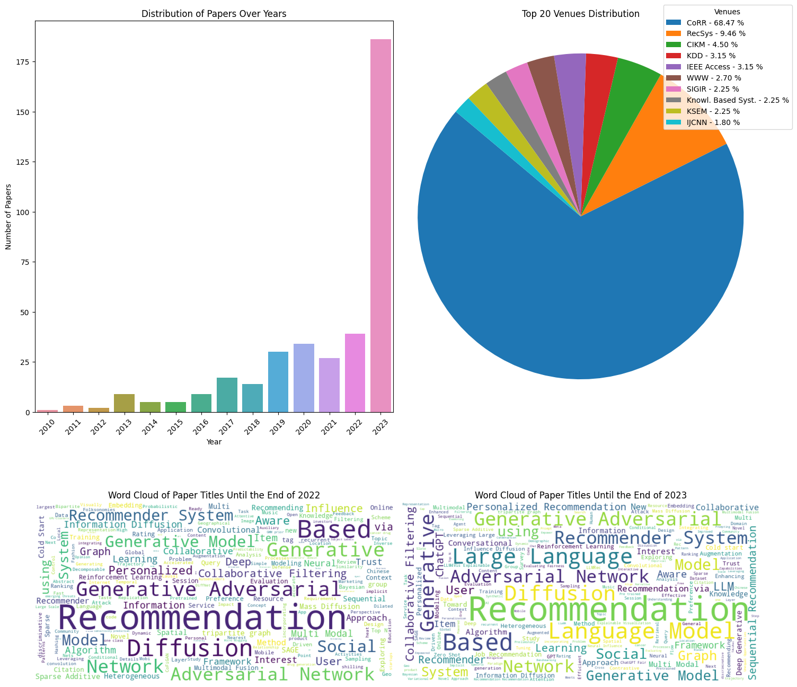

# Recommender Systems with Generative Models


<div align="center">
    
</div>


The table serves as an overview and extension of the works discussed in the following survey. Please consider citing it if you used the survey.

```
@article{DeldjooGenRecSys2024,
  title={A Review of Modern Recommender Systems Using Generative Models (Gen-RecSys)},
  author={Deldjoo, Yashar and He, Zhankui and Macuely, Julian and Korikov, Anton and Sanner, Scott and Ramisa, Arnau and Vidal, Rene and Sathiamoorthy, Mahesh and Kasizadeh, Atoosa and Milano, Silvia},
  journal={arXiv},
  year={2024}
}
```

| title                                                                                                                                                                  | authors                                                                                                                                                                                             |   year | venue                                           | keyword                            | doi                                                                                                      |
|:-----------------------------------------------------------------------------------------------------------------------------------------------------------------------|:----------------------------------------------------------------------------------------------------------------------------------------------------------------------------------------------------|-------:|:------------------------------------------------|:-----------------------------------|:---------------------------------------------------------------------------------------------------------|
| Prompt Distillation for Efficient LLM-based Recommendation.                                                                                                            | Lei Li 0042, Yongfeng Zhang, Li Chen 0009                                                                                                                                                           |   2023 | CIKM                                            | LLM recommend                      | [Link](https://doi.org/10.1145/3583780.3615017)                                                          |
| LLM4Vis: Explainable Visualization Recommendation using ChatGPT.                                                                                                       | Lei Wang 0185, Songheng Zhang, Yun Wang, Ee-Peng Lim, Yong Wang 0021                                                                                                                                |   2023 | EMNLP                                           | LLM recommend                      |                                                                                                          |
| Potentials of Combining Local Knowledge and LLMs for Recommender Systems.                                                                                              | Thomas E. Kolb, Ahmadou Wagne, Mete Sertkan, Julia Neidhardt                                                                                                                                        |   2023 | KaRS@RecSys                                     | LLM recommend                      |                                                                                                          |
| LLM Based Generation of Item-Description for Recommendation System.                                                                                                    | Arkadeep Acharya, Brijraj Singh, Naoyuki Onoe                                                                                                                                                       |   2023 | RecSys                                          | LLM recommend                      | [Link](https://doi.org/10.1145/3604915.3610647)                                                          |
| Heterogeneous Knowledge Fusion: A Novel Approach for Personalized Recommendation via LLM.                                                                              | Bin Yin, Junjie Xie, Yu Qin, Zixiang Ding, Zhichao Feng, Xiang Li, Wei Lin                                                                                                                          |   2023 | RecSys                                          | LLM recommend                      | [Link](https://doi.org/10.1145/3604915.3608874)                                                          |
| Chat-REC: Towards Interactive and Explainable LLMs-Augmented Recommender System.                                                                                       | Yunfan Gao, Tao Sheng, Youlin Xiang, Yun Xiong, Haofen Wang, Jiawei Zhang 0001                                                                                                                      |   2023 | CoRR                                            | LLM recommend                      | [Link](https://doi.org/10.48550/ARXIV.2303.14524)                                                        |
| A First Look at LLM-Powered Generative News Recommendation.                                                                                                            | Qijiong Liu, Nuo Chen, Tetsuya Sakai, Xiao-Ming Wu 0003                                                                                                                                             |   2023 | CoRR                                            | LLM recommend                      | [Link](https://doi.org/10.48550/ARXIV.2305.06566)                                                        |
| PALR: Personalization Aware LLMs for Recommendation.                                                                                                                   | Zheng Chen                                                                                                                                                                                          |   2023 | CoRR                                            | LLM recommend                      | [Link](https://doi.org/10.48550/ARXIV.2305.07622)                                                        |
| Recommender Systems in the Era of Large Language Models (LLMs).                                                                                                        | Wenqi Fan, Zihuai Zhao, Jiatong Li, Yunqing Liu, Xiaowei Mei, Yiqi Wang 0001, Jiliang Tang, Qing Li 0001                                                                                            |   2023 | CoRR                                            | LLM recommend                      | [Link](https://doi.org/10.48550/ARXIV.2307.02046)                                                        |
| Enhancing Job Recommendation through LLM-based Generative Adversarial Networks.                                                                                        | Yingpeng Du, Di Luo, Rui Yan, Hongzhi Liu, Yang Song 0021, Hengshu Zhu, Jie Zhang                                                                                                                   |   2023 | CoRR                                            | LLM recommend                      | [Link](https://doi.org/10.48550/ARXIV.2307.10747)                                                        |
| LLM-Rec: Personalized Recommendation via Prompting Large Language Models.                                                                                              | Hanjia Lyu, Song Jiang, Hanqing Zeng, Yinglong Xia, Jiebo Luo                                                                                                                                       |   2023 | CoRR                                            | LLM recommend                      | [Link](https://doi.org/10.48550/ARXIV.2307.15780)                                                        |
| Heterogeneous Knowledge Fusion: A Novel Approach for Personalized Recommendation via LLM.                                                                              | Bin Yin, Junjie Xie, Yu Qin, Zixiang Ding, Zhichao Feng, Xiang Li, Wei Lin 0001                                                                                                                     |   2023 | CoRR                                            | LLM recommend                      | [Link](https://doi.org/10.48550/ARXIV.2308.03333)                                                        |
| LKPNR: LLM and KG for Personalized News Recommendation Framework.                                                                                                      | Hao Chen, Runfeng Xie, Xiangyang Cui, Zhou Yan, Xin Wang, Zhanwei Xuan, Kai Zhang                                                                                                                   |   2023 | CoRR                                            | LLM recommend                      | [Link](https://doi.org/10.48550/ARXIV.2308.12028)                                                        |
| LLMRec: Benchmarking Large Language Models on Recommendation Task.                                                                                                     | Junling Liu, Chao Liu, Peilin Zhou, Qichen Ye, Dading Chong, Kang Zhou, Yueqi Xie, Yuwei Cao, Shoujin Wang, Chenyu You, Philip S. Yu                                                                |   2023 | CoRR                                            | LLM recommend                      | [Link](https://doi.org/10.48550/ARXIV.2308.12241)                                                        |
| JobRecoGPT - Explainable job recommendations using LLMs.                                                                                                               | Preetam Ghosh, Vaishali Sadaphal                                                                                                                                                                    |   2023 | CoRR                                            | LLM recommend                      | [Link](https://doi.org/10.48550/ARXIV.2309.11805)                                                        |
| LLM4Vis: Explainable Visualization Recommendation using ChatGPT.                                                                                                       | Lei Wang 0185, Songheng Zhang, Yun Wang, Ee-Peng Lim, Yong Wang 0021                                                                                                                                |   2023 | CoRR                                            | LLM recommend                      | [Link](https://doi.org/10.48550/ARXIV.2310.07652)                                                        |
| Leveraging Large Language Models (LLMs) to Empower Training-Free Dataset Condensation for Content-Based Recommendation.                                                | Jiahao Wu, Qijiong Liu, Hengchang Hu, Wenqi Fan, Shengcai Liu, Qing Li 0001, Xiao-Ming Wu, Ke Tang 0001                                                                                             |   2023 | CoRR                                            | LLM recommend                      | [Link](https://doi.org/10.48550/ARXIV.2310.09874)                                                        |
| LLMRec: Large Language Models with Graph Augmentation for Recommendation.                                                                                              | Wei Wei, Xubin Ren, Jiabin Tang, Qinyong Wang, Lixin Su, Suqi Cheng, Junfeng Wang, Dawei Yin, Chao Huang                                                                                            |   2023 | CoRR                                            | LLM recommend                      | [Link](https://doi.org/10.48550/ARXIV.2311.00423)                                                        |
| Bridging the Information Gap Between Domain-Specific Model and General LLM for Personalized Recommendation.                                                            | Wenxuan Zhang, Hongzhi Liu, Yingpeng Du, Chen Zhu, Yang Song, Hengshu Zhu, Zhonghai Wu                                                                                                              |   2023 | CoRR                                            | LLM recommend                      | [Link](https://doi.org/10.48550/ARXIV.2311.03778)                                                        |
| Do LLMs Implicitly Exhibit User Discrimination in Recommendation? An Empirical Study.                                                                                  | Chen Xu, Wenjie Wang, Yuxin Li, Liang Pang, Jun Xu, Tat-Seng Chua                                                                                                                                   |   2023 | CoRR                                            | LLM recommend                      | [Link](https://doi.org/10.48550/ARXIV.2311.07054)                                                        |
| DRDT: Dynamic Reflection with Divergent Thinking for LLM-based Sequential Recommendation.                                                                              | Yu Wang, Zhiwei Liu, Jianguo Zhang 0005, Weiran Yao, Shelby Heinecke, Philip S. Yu                                                                                                                  |   2023 | CoRR                                            | LLM recommend                      | [Link](https://doi.org/10.48550/ARXIV.2312.11336)                                                        |
| AsyncMLD: Asynchronous Multi-LLM Framework for Dialogue Recommendation System.                                                                                         | Naoki Yoshimaru, Motoharu Okuma, Takamasa Iio, Kenji Hatano                                                                                                                                         |   2023 | CoRR                                            | LLM recommend                      | [Link](https://doi.org/10.48550/ARXIV.2312.13925)                                                        |
| Logic-Scaffolding: Personalized Aspect-Instructed Recommendation Explanation Generation using LLMs.                                                                    | Behnam Rahdari, Hao Ding 0003, Ziwei Fan, Yifei Ma, Zhuotong Chen, Anoop Deoras, Branislav Kveton                                                                                                   |   2023 | CoRR                                            | LLM recommend                      | [Link](https://doi.org/10.48550/ARXIV.2312.14345)                                                        |
| LLMRS: Unlocking Potentials of LLM-Based Recommender Systems for Software Purchase.                                                                                    | Angela John, Theophilus Aidoo, Hamayoon Behmanush, Irem B. Gunduz, Hewan Shrestha, Maxx Richard Rahman, Wolfgang Maaß 0002                                                                          |   2024 | CoRR                                            | LLM recommend                      | [Link](https://doi.org/10.48550/ARXIV.2401.06676)                                                        |
| LLM-Guided Multi-View Hypergraph Learning for Human-Centric Explainable Recommendation.                                                                                | Zhixuan Chu, Yan Wang, Qing Cui, Longfei Li, Wenqing Chen, Sheng Li, Zhan Qin, Kui Ren 0001                                                                                                         |   2024 | CoRR                                            | LLM recommend                      | [Link](https://doi.org/10.48550/ARXIV.2401.08217)                                                        |
| Supporting Student Decisions on Learning Recommendations: An LLM-Based Chatbot with Knowledge Graph Contextualization for Conversational Explainability and Mentoring. | Hasan Abu-Rasheed, Mohamad Hussam Abdulsalam, Christian Weber 0003, Madjid Fathi                                                                                                                    |   2024 | CoRR                                            | LLM recommend                      | [Link](https://doi.org/10.48550/ARXIV.2401.08517)                                                        |
| Data-efficient Fine-tuning for LLM-based Recommendation.                                                                                                               | Xinyu Lin, Wenjie Wang, Yongqi Li 0001, Shuo Yang, Fuli Feng, Yinwei Wei, Tat-Seng Chua                                                                                                             |   2024 | CoRR                                            | LLM recommend                      | [Link](https://doi.org/10.48550/ARXIV.2401.17197)                                                        |
| Improving Sequential Recommendations with LLMs.                                                                                                                        | Artun Boz, Wouter Zorgdrager, Zoe Kotti, Jesse Harte, Panos Louridas, Dietmar Jannach, Marios Fragkoulis                                                                                            |   2024 | CoRR                                            | LLM recommend                      | [Link](https://doi.org/10.48550/ARXIV.2402.01339)                                                        |
| Finetuning Large-Scale Pre-trained Language Models for Conversational Recommendation with Knowledge Graph.                                                             | Lingzhi Wang, Huang Hu, Lei Sha, Can Xu, Kam-Fai Wong, Daxin Jiang                                                                                                                                  |   2021 | CoRR                                            | large language model recommend     |                                                                                                          |
| Training Large-Scale News Recommenders with Pretrained Language Models in the Loop.                                                                                    | Shitao Xiao, Zheng Liu, Yingxia Shao, Tao Di, Bhuvan Middha, Fangzhao Wu, Xing Xie 0001                                                                                                             |   2022 | KDD                                             | large language model recommend     | [Link](https://doi.org/10.1145/3534678.3539120)                                                          |
| Retrieval-augmented Recommender System: Enhancing Recommender Systems with Large Language Models.                                                                      | Dario Di Palma                                                                                                                                                                                      |   2023 | RecSys                                          | large language model recommend     | [Link](https://doi.org/10.1145/3604915.3608889)                                                          |
| Large Language Models are Competitive Near Cold-start Recommenders for Language- and Item-based Preferences.                                                           | Scott Sanner, Krisztian Balog, Filip Radlinski, Ben Wedin, Lucas Dixon                                                                                                                              |   2023 | RecSys                                          | large language model recommend     | [Link](https://doi.org/10.1145/3604915.3608845)                                                          |
| Is ChatGPT Fair for Recommendation? Evaluating Fairness in Large Language Model Recommendation.                                                                        | Jizhi Zhang, Keqin Bao, Yang Zhang 0072, Wenjie Wang 0007, Fuli Feng, Xiangnan He 0001                                                                                                              |   2023 | RecSys                                          | large language model recommend     | [Link](https://doi.org/10.1145/3604915.3608860)                                                          |
| Recommendation as Instruction Following: A Large Language Model Empowered Recommendation Approach.                                                                     | Junjie Zhang, Ruobing Xie, Yupeng Hou, Wayne Xin Zhao, Leyu Lin, Ji-Rong Wen                                                                                                                        |   2023 | CoRR                                            | large language model recommend     | [Link](https://doi.org/10.48550/ARXIV.2305.07001)                                                        |
| Is ChatGPT Fair for Recommendation? Evaluating Fairness in Large Language Model Recommendation.                                                                        | Jizhi Zhang, Keqin Bao, Yang Zhang 0072, Wenjie Wang 0007, Fuli Feng, Xiangnan He 0001                                                                                                              |   2023 | CoRR                                            | large language model recommend     | [Link](https://doi.org/10.48550/ARXIV.2305.07609)                                                        |
| Large language models in biomedical natural language processing: benchmarks, baselines, and recommendations.                                                           | Qingyu Chen 0001, Jingcheng Du, Yan Hu, Vipina Kuttichi Keloth, Xueqing Peng, Kalpana Raja, Rui Zhang, Zhiyong Lu, Hua Xu 0001                                                                      |   2023 | CoRR                                            | large language model recommend     | [Link](https://doi.org/10.48550/ARXIV.2305.16326)                                                        |
| Large Language Models are Competitive Near Cold-start Recommenders for Language- and Item-based Preferences.                                                           | Scott Sanner, Krisztian Balog, Filip Radlinski, Ben Wedin, Lucas Dixon                                                                                                                              |   2023 | CoRR                                            | large language model recommend     | [Link](https://doi.org/10.48550/ARXIV.2307.14225)                                                        |
| Recommender AI Agent: Integrating Large Language Models for Interactive Recommendations.                                                                               | Xu Huang 0008, Jianxun Lian, Yuxuan Lei, Jing Yao, Defu Lian, Xing Xie 0001                                                                                                                         |   2023 | CoRR                                            | large language model recommend     | [Link](https://doi.org/10.48550/ARXIV.2308.16505)                                                        |
| One Model for All: Large Language Models are Domain-Agnostic Recommendation Systems.                                                                                   | Zuoli Tang, Zhaoxin Huan, Zihao Li, Xiaolu Zhang, Jun Hu, Chilin Fu, Jun Zhou 0011, Chenliang Li                                                                                                    |   2023 | CoRR                                            | large language model recommend     | [Link](https://doi.org/10.48550/ARXIV.2310.14304)                                                        |
| Modeling User Viewing Flow using Large Language Models for Article Recommendation.                                                                                     | Zhenghao Liu, Zulong Chen, Moufeng Zhang, Shaoyang Duan, Hong Wen, Liangyue Li, Nan Li, Yu Gu 0002, Ge Yu 0001                                                                                      |   2023 | CoRR                                            | large language model recommend     | [Link](https://doi.org/10.48550/ARXIV.2311.07619)                                                        |
| RecExplainer: Aligning Large Language Models for Recommendation Model Interpretability.                                                                                | Yuxuan Lei, Jianxun Lian, Jing Yao, Xu Huang 0008, Defu Lian, Xing Xie 0001                                                                                                                         |   2023 | CoRR                                            | large language model recommend     | [Link](https://doi.org/10.48550/ARXIV.2311.10947)                                                        |
| Koya: A Recommender System for Large Language Model Selection.                                                                                                         | Abraham Toluwase Owodunni, Chris Chinenye Emezue                                                                                                                                                    |   2023 | AfricaNLP                                       | large language model recommend     |                                                                                                          |
| Large Language Models as Zero-Shot Conversational Recommenders.                                                                                                        | Zhankui He, Zhouhang Xie, Rahul Jha, Harald Steck, Dawen Liang, Yesu Feng, Bodhisattwa Prasad Majumder, Nathan Kallus, Julian J. McAuley                                                            |   2023 | CIKM                                            | large language model recommend     | [Link](https://doi.org/10.1145/3583780.3614949)                                                          |
| The Unequal Opportunities of Large Language Models: Examining Demographic Biases in Job Recommendations by ChatGPT and LLaMA.                                          | Abel Salinas, Parth Vipul Shah, Yuzhong Huang, Robert McCormack, Fred Morstatter                                                                                                                    |   2023 | EAAMO                                           | large language model recommend     | [Link](https://doi.org/10.1145/3617694.3623257)                                                          |
| Conversational Recommender System and Large Language Model Are Made for Each Other in E-commerce Pre-sales Dialogue.                                                   | Yuanxing Liu 0001, Weinan Zhang 0003, Yifan Chen, Yuchi Zhang, Haopeng Bai, Fan Feng, Hengbin Cui, Yongbin Li, Wanxiang Che                                                                         |   2023 | EMNLP                                           | large language model recommend     |                                                                                                          |
| Rethinking the Evaluation for Conversational Recommendation in the Era of Large Language Models.                                                                       | Xiaolei Wang, Xinyu Tang, Xin Zhao 0018, Jingyuan Wang, Ji-Rong Wen                                                                                                                                 |   2023 | EMNLP                                           | large language model recommend     |                                                                                                          |
| Leveraging Large Language Models for Goal-driven Interactive Recommendations.                                                                                          | Alan Said, Martijn C. Willemsen, Leandro Balby Marinho, Itallo Silva                                                                                                                                |   2023 | HAI                                             | large language model recommend     | [Link](https://doi.org/10.1145/3623809.3623965)                                                          |
| Recommending Root-Cause and Mitigation Steps for Cloud Incidents using Large Language Models.                                                                          | Toufique Ahmed, Supriyo Ghosh, Chetan Bansal, Thomas Zimmermann 0001, Xuchao Zhang, Saravan Rajmohan                                                                                                |   2023 | ICSE                                            | large language model recommend     | [Link](https://doi.org/10.1109/ICSE48619.2023.00149)                                                     |
| Plan, Generate and Match: Scientific Workflow Recommendation with Large Language Models.                                                                               | Yang Gu, Jian Cao 0001, Yuan Guo, Shiyou Qian, Wei Guan                                                                                                                                             |   2023 | ICSOC                                           | large language model recommend     | [Link](https://doi.org/10.1007/978-3-031-48421-6_7)                                                      |
| Leveraging Large Language Models for Recommendation and Explanation.                                                                                                   | Itallo Silva, Alan Said, Leandro Balby Marinho, Martijn C. Willemsen                                                                                                                                |   2023 | IntRS@RecSys                                    | large language model recommend     |                                                                                                          |
| TALLRec: An Effective and Efficient Tuning Framework to Align Large Language Model with Recommendation.                                                                | Keqin Bao, Jizhi Zhang, Yang Zhang 0072, Wenjie Wang 0007, Fuli Feng, Xiangnan He 0001                                                                                                              |   2023 | RecSys                                          | large language model recommend     | [Link](https://doi.org/10.1145/3604915.3608857)                                                          |
| Leveraging Large Language Models for Sequential Recommendation.                                                                                                        | Jesse Harte, Wouter Zorgdrager, Panos Louridas, Asterios Katsifodimos, Dietmar Jannach, Marios Fragkoulis                                                                                           |   2023 | RecSys                                          | large language model recommend     | [Link](https://doi.org/10.1145/3604915.3610639)                                                          |
| Tutorial on Large Language Models for Recommendation.                                                                                                                  | Wenyue Hua, Lei Li 0042, Shuyuan Xu, Li Chen 0009, Yongfeng Zhang                                                                                                                                   |   2023 | RecSys                                          | large language model recommend     | [Link](https://doi.org/10.1145/3604915.3609494)                                                          |
| Large Language Model Augmented Narrative Driven Recommendations.                                                                                                       | Sheshera Mysore, Andrew McCallum, Hamed Zamani                                                                                                                                                      |   2023 | RecSys                                          | large language model recommend     | [Link](https://doi.org/10.1145/3604915.3608829)                                                          |
| User-Centric Conversational Recommendation: Adapting the Need of User with Large Language Models.                                                                      | Gangyi Zhang                                                                                                                                                                                        |   2023 | RecSys                                          | large language model recommend     | [Link](https://doi.org/10.1145/3604915.3608885)                                                          |
| Large Language Models for Recommendation: Progresses and Future Directions.                                                                                            | Keqin Bao, Jizhi Zhang, Yang Zhang, Wang Wenjie, Fuli Feng, Xiangnan He 0001                                                                                                                        |   2023 | SIGIR-AP                                        | large language model recommend     | [Link](https://doi.org/10.1145/3624918.3629550)                                                          |
| Recommending Root-Cause and Mitigation Steps for Cloud Incidents using Large Language Models.                                                                          | Toufique Ahmed, Supriyo Ghosh, Chetan Bansal, Thomas Zimmermann 0001, Xuchao Zhang, Saravan Rajmohan                                                                                                |   2023 | CoRR                                            | large language model recommend     | [Link](https://doi.org/10.48550/ARXIV.2301.03797)                                                        |
| Zero-Shot Next-Item Recommendation using Large Pretrained Language Models.                                                                                             | Lei Wang 0185, Ee-Peng Lim                                                                                                                                                                          |   2023 | CoRR                                            | large language model recommend     | [Link](https://doi.org/10.48550/ARXIV.2304.03153)                                                        |
| TALLRec: An Effective and Efficient Tuning Framework to Align Large Language Model with Recommendation.                                                                | Keqin Bao, Jizhi Zhang, Yang Zhang 0072, Wenjie Wang 0007, Fuli Feng, Xiangnan He 0001                                                                                                              |   2023 | CoRR                                            | large language model recommend     | [Link](https://doi.org/10.48550/ARXIV.2305.00447)                                                        |
| Privacy-Preserving Recommender Systems with Synthetic Query Generation using Differentially Private Large Language Models.                                             | Aldo Gael Carranza, Rezsa Farahani, Natalia Ponomareva, Alex Kurakin, Matthew Jagielski, Milad Nasr                                                                                                 |   2023 | CoRR                                            | large language model recommend     | [Link](https://doi.org/10.48550/ARXIV.2305.05973)                                                        |
| Leveraging Large Language Models in Conversational Recommender Systems.                                                                                                | Luke Friedman, Sameer Ahuja, David Allen, Zhenning Tan, Hakim Sidahmed, Changbo Long, Jun Xie, Gabriel Schubiner, Ajay Patel, Harsh Lara, Brian Chu, Zexi Chen, Manoj Tiwari                        |   2023 | CoRR                                            | large language model recommend     | [Link](https://doi.org/10.48550/ARXIV.2305.07961)                                                        |
| Large Language Models are Zero-Shot Rankers for Recommender Systems.                                                                                                   | Yupeng Hou, Junjie Zhang, Zihan Lin, Hongyu Lu, Ruobing Xie, Julian J. McAuley, Wayne Xin Zhao                                                                                                      |   2023 | CoRR                                            | large language model recommend     | [Link](https://doi.org/10.48550/ARXIV.2305.08845)                                                        |
| Rethinking the Evaluation for Conversational Recommendation in the Era of Large Language Models.                                                                       | Xiaolei Wang, Xinyu Tang, Wayne Xin Zhao, Jingyuan Wang, Ji-Rong Wen                                                                                                                                |   2023 | CoRR                                            | large language model recommend     | [Link](https://doi.org/10.48550/ARXIV.2305.13112)                                                        |
| BookGPT: A General Framework for Book Recommendation Empowered by Large Language Model.                                                                                | Aakas Zhiyuli, Yanfang Chen, Xuan Zhang 0009, Xun Liang 0001                                                                                                                                        |   2023 | CoRR                                            | large language model recommend     | [Link](https://doi.org/10.48550/ARXIV.2305.15673)                                                        |
| A Survey on Large Language Models for Recommendation.                                                                                                                  | Likang Wu, Zhi Zheng, Zhaopeng Qiu, Hao Wang 0076, Hongchao Gu, Tingjia Shen, Chuan Qin 0002, Chen Zhu, Hengshu Zhu, Qi Liu 0003, Hui Xiong 0001, Enhong Chen                                       |   2023 | CoRR                                            | large language model recommend     | [Link](https://doi.org/10.48550/ARXIV.2305.19860)                                                        |
| Prompt Tuning Large Language Models on Personalized Aspect Extraction for Recommendations.                                                                             | Pan Li, Yuyan Wang, Ed H. Chi, Minmin Chen                                                                                                                                                          |   2023 | CoRR                                            | large language model recommend     | [Link](https://doi.org/10.48550/ARXIV.2306.01475)                                                        |
| Large Language Model Augmented Narrative Driven Recommendations.                                                                                                       | Sheshera Mysore, Andrew McCallum, Hamed Zamani                                                                                                                                                      |   2023 | CoRR                                            | large language model recommend     | [Link](https://doi.org/10.48550/ARXIV.2306.02250)                                                        |
| How Can Recommender Systems Benefit from Large Language Models: A Survey.                                                                                              | Jianghao Lin, Xinyi Dai, Yunjia Xi, Weiwen Liu, Bo Chen 0023, Xiangyang Li, Chenxu Zhu, Huifeng Guo, Yong Yu 0001, Ruiming Tang, Weinan Zhang 0001                                                  |   2023 | CoRR                                            | large language model recommend     | [Link](https://doi.org/10.48550/ARXIV.2306.05817)                                                        |
| Towards Open-World Recommendation with Knowledge Augmentation from Large Language Models.                                                                              | Yunjia Xi, Weiwen Liu, Jianghao Lin, Jieming Zhu, Bo Chen 0023, Ruiming Tang, Weinan Zhang 0001, Rui Zhang 0003, Yong Yu 0001                                                                       |   2023 | CoRR                                            | large language model recommend     | [Link](https://doi.org/10.48550/ARXIV.2306.10933)                                                        |
| GenRec: Large Language Model for Generative Recommendation.                                                                                                            | Jianchao Ji, Zelong Li, Shuyuan Xu, Wenyue Hua, Yingqiang Ge, Juntao Tan, Yongfeng Zhang                                                                                                            |   2023 | CoRR                                            | large language model recommend     | [Link](https://doi.org/10.48550/ARXIV.2307.00457)                                                        |
| Recommender Systems in the Era of Large Language Models (LLMs).                                                                                                        | Wenqi Fan, Zihuai Zhao, Jiatong Li, Yunqing Liu, Xiaowei Mei, Yiqi Wang 0001, Jiliang Tang, Qing Li 0001                                                                                            |   2023 | CoRR                                            | large language model recommend     | [Link](https://doi.org/10.48550/ARXIV.2307.02046)                                                        |
| Generative Job Recommendations with Large Language Model.                                                                                                              | Zhi Zheng, Zhaopeng Qiu, Xiao Hu, Likang Wu, Hengshu Zhu, Hui Xiong 0001                                                                                                                            |   2023 | CoRR                                            | large language model recommend     | [Link](https://doi.org/10.48550/ARXIV.2307.02157)                                                        |
| Exploring Large Language Model for Graph Data Understanding in Online Job Recommendations.                                                                             | Likang Wu, Zhaopeng Qiu, Zhi Zheng, Hengshu Zhu, Enhong Chen                                                                                                                                        |   2023 | CoRR                                            | large language model recommend     | [Link](https://doi.org/10.48550/ARXIV.2307.05722)                                                        |
| LLM-Rec: Personalized Recommendation via Prompting Large Language Models.                                                                                              | Hanjia Lyu, Song Jiang, Hanqing Zeng, Yinglong Xia, Jiebo Luo                                                                                                                                       |   2023 | CoRR                                            | large language model recommend     | [Link](https://doi.org/10.48550/ARXIV.2307.15780)                                                        |
| The Unequal Opportunities of Large Language Models: Revealing Demographic Bias through Job Recommendations.                                                            | Abel Salinas, Parth Vipul Shah, Yuzhong Huang, Robert McCormack, Fred Morstatter                                                                                                                    |   2023 | CoRR                                            | large language model recommend     | [Link](https://doi.org/10.48550/ARXIV.2308.02053)                                                        |
| A Large Language Model Enhanced Conversational Recommender System.                                                                                                     | Yue Feng, Shuchang Liu 0006, Zhenghai Xue, Qingpeng Cai 0001, Lantao Hu, Peng Jiang 0002, Kun Gai, Fei Sun                                                                                          |   2023 | CoRR                                            | large language model recommend     | [Link](https://doi.org/10.48550/ARXIV.2308.06212)                                                        |
| A Bi-Step Grounding Paradigm for Large Language Models in Recommendation Systems.                                                                                      | Keqin Bao, Jizhi Zhang, Wenjie Wang 0007, Yang Zhang 0072, Zhengyi Yang 0007, Yancheng Luo, Fuli Feng, Xiangnan He 0001, Qi Tian 0001                                                               |   2023 | CoRR                                            | large language model recommend     | [Link](https://doi.org/10.48550/ARXIV.2308.08434)                                                        |
| RAH! RecSys-Assistant-Human: A Human-Central Recommendation Framework with Large Language Models.                                                                      | Yubo Shu, Hansu Gu, Peng Zhang 0060, Haonan Zhang, Tun Lu, Dongsheng Li, Ning Gu                                                                                                                    |   2023 | CoRR                                            | large language model recommend     | [Link](https://doi.org/10.48550/ARXIV.2308.09904)                                                        |
| Large Language Models as Zero-Shot Conversational Recommenders.                                                                                                        | Zhankui He, Zhouhang Xie, Rahul Jha, Harald Steck, Dawen Liang, Yesu Feng, Bodhisattwa Prasad Majumder, Nathan Kallus, Julian J. McAuley                                                            |   2023 | CoRR                                            | large language model recommend     | [Link](https://doi.org/10.48550/ARXIV.2308.10053)                                                        |
| Enhancing Recommender Systems with Large Language Model Reasoning Graphs.                                                                                              | Yan Wang, Zhixuan Chu, Xin Ouyang, Simeng Wang, Hongyan Hao, Yue Shen, Jinjie Gu, Siqiao Xue, James Y. Zhang, Qing Cui, Longfei Li, Jun Zhou 0011, Sheng Li 0001                                    |   2023 | CoRR                                            | large language model recommend     | [Link](https://doi.org/10.48550/ARXIV.2308.10835)                                                        |
| Leveraging Large Language Models for Pre-trained Recommender Systems.                                                                                                  | Zhixuan Chu, Hongyan Hao, Xin Ouyang, Simeng Wang, Yan Wang, Yue Shen, Jinjie Gu, Qing Cui, Longfei Li, Siqiao Xue, James Y. Zhang, Sheng Li 0001                                                   |   2023 | CoRR                                            | large language model recommend     | [Link](https://doi.org/10.48550/ARXIV.2308.10837)                                                        |
| ReLLa: Retrieval-enhanced Large Language Models for Lifelong Sequential Behavior Comprehension in Recommendation.                                                      | Jianghao Lin, Rong Shan, Chenxu Zhu, Kounianhua Du, Bo Chen 0023, Shigang Quan, Ruiming Tang, Yong Yu 0001, Weinan Zhang 0001                                                                       |   2023 | CoRR                                            | large language model recommend     | [Link](https://doi.org/10.48550/ARXIV.2308.11131)                                                        |
| LLMRec: Benchmarking Large Language Models on Recommendation Task.                                                                                                     | Junling Liu, Chao Liu, Peilin Zhou, Qichen Ye, Dading Chong, Kang Zhou, Yueqi Xie, Yuwei Cao, Shoujin Wang, Chenyu You, Philip S. Yu                                                                |   2023 | CoRR                                            | large language model recommend     | [Link](https://doi.org/10.48550/ARXIV.2308.12241)                                                        |
| RecMind: Large Language Model Powered Agent For Recommendation.                                                                                                        | Yancheng Wang, Ziyan Jiang, Zheng Chen 0010, Fan Yang, Yingxue Zhou, Eunah Cho, Xing Fan, Xiaojiang Huang, Yanbin Lu, Yingzhen Yang                                                                 |   2023 | CoRR                                            | large language model recommend     | [Link](https://doi.org/10.48550/ARXIV.2308.14296)                                                        |
| Zero-Shot Recommendations with Pre-Trained Large Language Models for Multimodal Nudging.                                                                               | Rachel M. Harrison, Anton Dereventsov, Anton Bibin                                                                                                                                                  |   2023 | CoRR                                            | large language model recommend     | [Link](https://doi.org/10.48550/ARXIV.2309.01026)                                                        |
| Large Language Models for Generative Recommendation: A Survey and Visionary Discussions.                                                                               | Lei Li 0042, Yongfeng Zhang, Dugang Liu, Li Chen 0009                                                                                                                                               |   2023 | CoRR                                            | large language model recommend     | [Link](https://doi.org/10.48550/ARXIV.2309.01157)                                                        |
| Leveraging Large Language Models for Sequential Recommendation.                                                                                                        | Jesse Harte, Wouter Zorgdrager, Panos Louridas, Asterios Katsifodimos, Dietmar Jannach, Marios Fragkoulis                                                                                           |   2023 | CoRR                                            | large language model recommend     | [Link](https://doi.org/10.48550/ARXIV.2309.09261)                                                        |
| Towards Efficient and Effective Adaptation of Large Language Models for Sequential Recommendation.                                                                     | Bo Peng 0009, Ben Burns, Ziqi Chen, Srinivasan Parthasarathy 0001, Xia Ning                                                                                                                         |   2023 | CoRR                                            | large language model recommend     | [Link](https://doi.org/10.48550/ARXIV.2310.01612)                                                        |
| A Multi-facet Paradigm to Bridge Large Language Model and Recommendation.                                                                                              | Xinyu Lin, Wenjie Wang, Yongqi Li 0001, Fuli Feng, See-Kiong Ng, Tat-Seng Chua                                                                                                                      |   2023 | CoRR                                            | large language model recommend     | [Link](https://doi.org/10.48550/ARXIV.2310.06491)                                                        |
| Leveraging Large Language Models (LLMs) to Empower Training-Free Dataset Condensation for Content-Based Recommendation.                                                | Jiahao Wu, Qijiong Liu, Hengchang Hu, Wenqi Fan, Shengcai Liu, Qing Li 0001, Xiao-Ming Wu, Ke Tang 0001                                                                                             |   2023 | CoRR                                            | large language model recommend     | [Link](https://doi.org/10.48550/ARXIV.2310.09874)                                                        |
| Conversational Recommender System and Large Language Model Are Made for Each Other in E-commerce Pre-sales Dialogue.                                                   | Yuanxing Liu 0001, Wei-Nan Zhang 0003, Yifan Chen, Yuchi Zhang, Haopeng Bai, Fan Feng, Hengbin Cui, Yongbin Li, Wanxiang Che                                                                        |   2023 | CoRR                                            | large language model recommend     | [Link](https://doi.org/10.48550/ARXIV.2310.14626)                                                        |
| Representation Learning with Large Language Models for Recommendation.                                                                                                 | Xubin Ren, Wei Wei, Lianghao Xia, Lixin Su, Suqi Cheng, Junfeng Wang, Dawei Yin, Chao Huang 0001                                                                                                    |   2023 | CoRR                                            | large language model recommend     | [Link](https://doi.org/10.48550/ARXIV.2310.15950)                                                        |
| Multiple Key-value Strategy in Recommendation Systems Incorporating Large Language Model.                                                                              | Dui Wang, Xiangyu Hou, Xiaohui Yang, Bo Zhang, Renbing Chen, Daiyue Xue                                                                                                                             |   2023 | CoRR                                            | large language model recommend     | [Link](https://doi.org/10.48550/ARXIV.2310.16409)                                                        |
| A Multimodal Ecological Civilization Pattern Recommendation Method Based on Large Language Models and Knowledge Graph.                                                 | Zhihang Yu, Shu Wang, Yunqiang Zhu, Zhiqiang Zou                                                                                                                                                    |   2023 | CoRR                                            | large language model recommend     | [Link](https://doi.org/10.48550/ARXIV.2310.18951)                                                        |
| CoLLM: Integrating Collaborative Embeddings into Large Language Models for Recommendation.                                                                             | Yang Zhang, Fuli Feng, Jizhi Zhang, Keqin Bao, Qifan Wang, Xiangnan He 0001                                                                                                                         |   2023 | CoRR                                            | large language model recommend     | [Link](https://doi.org/10.48550/ARXIV.2310.19488)                                                        |
| Large Language Model Can Interpret Latent Space of Sequential Recommender.                                                                                             | Zhengyi Yang 0007, Jiancan Wu, Yanchen Luo, Jizhi Zhang, Yancheng Yuan, An Zhang 0003, Xiang Wang 0010, Xiangnan He 0001                                                                            |   2023 | CoRR                                            | large language model recommend     | [Link](https://doi.org/10.48550/ARXIV.2310.20487)                                                        |
| LLMRec: Large Language Models with Graph Augmentation for Recommendation.                                                                                              | Wei Wei, Xubin Ren, Jiabin Tang, Qinyong Wang, Lixin Su, Suqi Cheng, Junfeng Wang, Dawei Yin, Chao Huang                                                                                            |   2023 | CoRR                                            | large language model recommend     | [Link](https://doi.org/10.48550/ARXIV.2311.00423)                                                        |
| Collaborative Large Language Model for Recommender Systems.                                                                                                            | Yaochen Zhu, Liang Wu 0006, Qi Guo, Liangjie Hong, Jundong Li                                                                                                                                       |   2023 | CoRR                                            | large language model recommend     | [Link](https://doi.org/10.48550/ARXIV.2311.01343)                                                        |
| LlamaRec: Two-Stage Recommendation using Large Language Models for Ranking.                                                                                            | Zhenrui Yue, Sara Rabhi, Gabriel de Souza Pereira Moreira, Dong Wang, Even Oldridge                                                                                                                 |   2023 | CoRR                                            | large language model recommend     | [Link](https://doi.org/10.48550/ARXIV.2311.02089)                                                        |
| Adapting Large Language Models by Integrating Collaborative Semantics for Recommendation.                                                                              | Bowen Zheng, Yupeng Hou, Hongyu Lu, Yu Chen, Wayne Xin Zhao, Ming Chen, Ji-Rong Wen                                                                                                                 |   2023 | CoRR                                            | large language model recommend     | [Link](https://doi.org/10.48550/ARXIV.2311.09049)                                                        |
| Knowledge Plugins: Enhancing Large Language Models for Domain-Specific Recommendations.                                                                                | Jing Yao, Wei Xu, Jianxun Lian, Xiting Wang, Xiaoyuan Yi, Xing Xie 0001                                                                                                                             |   2023 | CoRR                                            | large language model recommend     | [Link](https://doi.org/10.48550/ARXIV.2311.10779)                                                        |
| A Survey on Large Language Models for Personalized and Explainable Recommendations.                                                                                    | Junyi Chen                                                                                                                                                                                          |   2023 | CoRR                                            | large language model recommend     | [Link](https://doi.org/10.48550/ARXIV.2311.12338)                                                        |
| E4SRec: An Elegant Effective Efficient Extensible Solution of Large Language Models for Sequential Recommendation.                                                     | Xinhang Li, Chong Chen, Xiangyu Zhao 0001, Yong Zhang, Chunxiao Xing                                                                                                                                |   2023 | CoRR                                            | large language model recommend     | [Link](https://doi.org/10.48550/ARXIV.2312.02443)                                                        |
| LLaRA: Aligning Large Language Models with Sequential Recommenders.                                                                                                    | Jiayi Liao, Sihang Li, Zhengyi Yang 0007, Jiancan Wu, Yancheng Yuan, Xiang Wang                                                                                                                     |   2023 | CoRR                                            | large language model recommend     | [Link](https://doi.org/10.48550/ARXIV.2312.02445)                                                        |
| Large Language Models for Intent-Driven Session Recommendations.                                                                                                       | Zhu Sun, Hongyang Liu, Xinghua Qu, Kaidong Feng, Yan Wang, Yew-Soon Ong                                                                                                                             |   2023 | CoRR                                            | large language model recommend     | [Link](https://doi.org/10.48550/ARXIV.2312.07552)                                                        |
| RecPrompt: A Prompt Tuning Framework for News Recommendation Using Large Language Models.                                                                              | Dairui Liu, Boming Yang, Honghui Du, Derek Greene, Aonghus Lawlor, Ruihai Dong, Irene Li                                                                                                            |   2023 | CoRR                                            | large language model recommend     | [Link](https://doi.org/10.48550/ARXIV.2312.10463)                                                        |
| Xpert: Empowering Incident Management with Query Recommendations via Large Language Models.                                                                            | Yuxuan Jiang, Chaoyun Zhang, Shilin He, Zhihao Yang, Minghua Ma, Si Qin, Yu Kang 0006, Yingnong Dang, Saravan Rajmohan, Qingwei Lin, Dongmei Zhang                                                  |   2023 | CoRR                                            | large language model recommend     | [Link](https://doi.org/10.48550/ARXIV.2312.11988)                                                        |
| Empowering Few-Shot Recommender Systems with Large Language Models - Enhanced Representations.                                                                         | Zhoumeng Wang                                                                                                                                                                                       |   2023 | CoRR                                            | large language model recommend     | [Link](https://doi.org/10.48550/ARXIV.2312.13557)                                                        |
| Preliminary Study on Incremental Learning for Large Language Model-based Recommender Systems.                                                                          | Tianhao Shi, Yang Zhang, Zhijian Xu, Chong Chen 0002, Fuli Feng, Xiangnan He 0001, Qi Tian 0001                                                                                                     |   2023 | CoRR                                            | large language model recommend     | [Link](https://doi.org/10.48550/ARXIV.2312.15599)                                                        |
| Unlocking the Potential of Large Language Models for Explainable Recommendations.                                                                                      | Yucong Luo, Mingyue Cheng, Hao Zhang, Junyu Lu, Qi Liu, Enhong Chen                                                                                                                                 |   2023 | CoRR                                            | large language model recommend     | [Link](https://doi.org/10.48550/ARXIV.2312.15661)                                                        |
| Large Language Models are Not Stable Recommender Systems.                                                                                                              | Tianhui Ma, Yuan Cheng, Hengshu Zhu, Hui Xiong 0001                                                                                                                                                 |   2023 | CoRR                                            | large language model recommend     | [Link](https://doi.org/10.48550/ARXIV.2312.15746)                                                        |
| RecRanker: Instruction Tuning Large Language Model as Ranker for Top-k Recommendation.                                                                                 | Sichun Luo, Bowei He, Haohan Zhao, Yinya Huang, Aojun Zhou, Zongpeng Li, Yuanzhang Xiao, Mingjie Zhan, Linqi Song                                                                                   |   2023 | CoRR                                            | large language model recommend     | [Link](https://doi.org/10.48550/ARXIV.2312.16018)                                                        |
| Understanding Before Recommendation: Semantic Aspect-Aware Review Exploitation via Large Language Models.                                                              | Fan Liu, Yaqi Liu, Zhiyong Cheng 0001, Liqiang Nie, Mohan S. Kankanhalli                                                                                                                            |   2023 | CoRR                                            | large language model recommend     | [Link](https://doi.org/10.48550/ARXIV.2312.16275)                                                        |
| Large Language Model Distilling Medication Recommendation Model.                                                                                                       | Qidong Liu, Xian Wu, Xiangyu Zhao 0001, Yuanshao Zhu, Zijian Zhang, Feng Tian 0002, Yefeng Zheng 0001                                                                                               |   2024 | CoRR                                            | large language model recommend     | [Link](https://doi.org/10.48550/ARXIV.2402.02803)                                                        |
| Unveiling Bias in Fairness Evaluations of Large Language Models: A Critical Literature Review of Music and Movie Recommendation Systems.                               | Chandan Kumar Sah, Xiaoli Lian, Muhammad Mirajul Islam                                                                                                                                              |   2024 | CoRR                                            | large language model recommend     | [Link](https://doi.org/10.48550/ARXIV.2401.04057)                                                        |
| Prompting Large Language Models for Recommender Systems: A Comprehensive Framework and Empirical Analysis.                                                             | Lanling Xu, Junjie Zhang, Bingqian Li, Jinpeng Wang, Mingchen Cai, Wayne Xin Zhao, Ji-Rong Wen                                                                                                      |   2024 | CoRR                                            | large language model recommend     | [Link](https://doi.org/10.48550/ARXIV.2401.04997)                                                        |
| Enhancing Recommendation Diversity by Re-ranking with Large Language Models.                                                                                           | Diego Carraro, Derek Bridge 0001                                                                                                                                                                    |   2024 | CoRR                                            | large language model recommend     | [Link](https://doi.org/10.48550/ARXIV.2401.11506)                                                        |
| Integrating Large Language Models into Recommendation via Mutual Augmentation and Adaptive Aggregation.                                                                | Sichun Luo, Yuxuan Yao, Bowei He, Yinya Huang, Aojun Zhou, Xinyi Zhang, Yuanzhang Xiao, Mingjie Zhan, Linqi Song                                                                                    |   2024 | CoRR                                            | large language model recommend     | [Link](https://doi.org/10.48550/ARXIV.2401.13870)                                                        |
| LoRec: Large Language Model for Robust Sequential Recommendation against Poisoning Attacks.                                                                            | Kaike Zhang, Qi Cao, Yunfan Wu, Fei Sun 0001, Huawei Shen, Xueqi Cheng                                                                                                                              |   2024 | CoRR                                            | large language model recommend     | [Link](https://doi.org/10.48550/ARXIV.2401.17723)                                                        |
| From PARIS to LE-PARIS: Toward Patent Response Automation with Recommender Systems and Collaborative Large Language Models.                                            | Jung-Mei Chu, Hao-Cheng Lo, Jieh Hsiang, Chun-Chieh Cho                                                                                                                                             |   2024 | CoRR                                            | large language model recommend     | [Link](https://doi.org/10.48550/ARXIV.2402.00421)                                                        |
| Uncertainty-Aware Explainable Recommendation with Large Language Models.                                                                                               | Yicui Peng, Hao Chen, Chingsheng Lin, Guo Huang, Jinrong Hu, Hui Guo, Bin Kong, Shu Hu, Xi Wu, Xin Wang                                                                                             |   2024 | CoRR                                            | large language model recommend     | [Link](https://doi.org/10.48550/ARXIV.2402.03366)                                                        |
| Is ChatGPT Fair for Recommendation? Evaluating Fairness in Large Language Model Recommendation.                                                                        | Jizhi Zhang, Keqin Bao, Yang Zhang 0072, Wenjie Wang 0007, Fuli Feng, Xiangnan He 0001                                                                                                              |   2023 | RecSys                                          | ChatGPT recommend                  | [Link](https://doi.org/10.1145/3604915.3608860)                                                          |
| Is ChatGPT Fair for Recommendation? Evaluating Fairness in Large Language Model Recommendation.                                                                        | Jizhi Zhang, Keqin Bao, Yang Zhang 0072, Wenjie Wang 0007, Fuli Feng, Xiangnan He 0001                                                                                                              |   2023 | CoRR                                            | ChatGPT recommend                  | [Link](https://doi.org/10.48550/ARXIV.2305.07609)                                                        |
| Sparks of Artificial General Recommender (AGR): Experiments with ChatGPT.                                                                                              | Guo Lin, Yongfeng Zhang                                                                                                                                                                             |   2023 | Algorithms                                      | ChatGPT recommend                  | [Link](https://doi.org/10.3390/A16090432)                                                                |
| Exploring ChatGPT's Potential for Consultation, Recommendations and Report Diagnosis: Gastric Cancer and Gastroscopy Reports' Case.                                    | Jiaming Zhou, Tengyue Li, Simon James Fong, Nilanjan Dey, Rubén González Crespo                                                                                                                     |   2023 | Int. J. Interact. Multim. Artif. Intell.        | ChatGPT recommend                  | [Link](https://doi.org/10.9781/IJIMAI.2023.04.007)                                                       |
| Using ChatGPT and Persuasive Technology for Personalized Recommendation Messages in Hotel Upselling.                                                                   | Manolis Remountakis, Konstantinos Kotis, Babis Kourtzis, George E. Tsekouras                                                                                                                        |   2023 | Inf.                                            | ChatGPT recommend                  | [Link](https://doi.org/10.3390/INFO14090504)                                                             |
| Recommendations to Create Programming Exercises to Overcome ChatGPT.                                                                                                   | Jonnathan Berrezueta-Guzman, Stephan Krusche                                                                                                                                                        |   2023 | CSEE&T                                          | ChatGPT recommend                  | [Link](https://doi.org/10.1109/CSEET58097.2023.00031)                                                    |
| The Unequal Opportunities of Large Language Models: Examining Demographic Biases in Job Recommendations by ChatGPT and LLaMA.                                          | Abel Salinas, Parth Vipul Shah, Yuzhong Huang, Robert McCormack, Fred Morstatter                                                                                                                    |   2023 | EAAMO                                           | ChatGPT recommend                  | [Link](https://doi.org/10.1145/3617694.3623257)                                                          |
| LLM4Vis: Explainable Visualization Recommendation using ChatGPT.                                                                                                       | Lei Wang 0185, Songheng Zhang, Yun Wang, Ee-Peng Lim, Yong Wang 0021                                                                                                                                |   2023 | EMNLP                                           | ChatGPT recommend                  |                                                                                                          |
| Exploring the Feasibility of ChatGPT for Improving the Quality of Ansible Scripts in Edge-Cloud Infrastructures Through Code Recommendation.                           | Sunjae Kwon, Sungu Lee, Taehyoun Kim, Duksan Ryu, Jongmoon Baik                                                                                                                                     |   2023 | ICWE Workshops                                  | ChatGPT recommend                  | [Link](https://doi.org/10.1007/978-3-031-50385-6_7)                                                      |
| A Preliminary Study of ChatGPT on News Recommendation: Personalization, Provider Fairness, and Fake News.                                                              | Xinyi Li, Yongfeng Zhang, Edward C. Malthouse                                                                                                                                                       |   2023 | INRA@RecSys                                     | ChatGPT recommend                  |                                                                                                          |
| Uncovering ChatGPT's Capabilities in Recommender Systems.                                                                                                              | Sunhao Dai, Ninglu Shao, Haiyuan Zhao, Weijie Yu, Zihua Si, Chen Xu 0010, Zhongxiang Sun, Xiao Zhang 0034, Jun Xu 0001                                                                              |   2023 | RecSys                                          | ChatGPT recommend                  | [Link](https://doi.org/10.1145/3604915.3610646)                                                          |
| Assessing the Readability of ChatGPT Code Snippet Recommendations: A Comparative Study.                                                                                | Carlos Eduardo de Carvalho Dantas, Adriano M. Rocha, Marcelo de Almeida Maia                                                                                                                        |   2023 | SBES                                            | ChatGPT recommend                  | [Link](https://doi.org/10.1145/3613372.3613413)                                                          |
| Is ChatGPT a Good Recommender? A Preliminary Study.                                                                                                                    | Junling Liu, Chao Liu, Renjie Lv, Kang Zhou, Yan Zhang                                                                                                                                              |   2023 | CoRR                                            | ChatGPT recommend                  | [Link](https://doi.org/10.48550/ARXIV.2304.10149)                                                        |
| Uncovering ChatGPT's Capabilities in Recommender Systems.                                                                                                              | Sunhao Dai, Ninglu Shao, Haiyuan Zhao, Weijie Yu, Zihua Si, Chen Xu, Zhongxiang Sun, Xiao Zhang 0034, Jun Xu 0001                                                                                   |   2023 | CoRR                                            | ChatGPT recommend                  | [Link](https://doi.org/10.48550/ARXIV.2305.02182)                                                        |
| Sparks of Artificial General Recommender (AGR): Early Experiments with ChatGPT.                                                                                        | Guo Lin, Yongfeng Zhang                                                                                                                                                                             |   2023 | CoRR                                            | ChatGPT recommend                  | [Link](https://doi.org/10.48550/ARXIV.2305.04518)                                                        |
| Chatbots to ChatGPT in a Cybersecurity Space: Evolution, Vulnerabilities, Attacks, Challenges, and Future Recommendations.                                             | Attia Qammar, Hongmei Wang, Jianguo Ding, Abdenacer Naouri, Mahmoud Daneshmand, Huansheng Ning                                                                                                      |   2023 | CoRR                                            | ChatGPT recommend                  | [Link](https://doi.org/10.48550/ARXIV.2306.09255)                                                        |
| A Preliminary Study of ChatGPT on News Recommendation: Personalization, Provider Fairness, Fake News.                                                                  | Xinyi Li, Yongfeng Zhang, Edward C. Malthouse                                                                                                                                                       |   2023 | CoRR                                            | ChatGPT recommend                  | [Link](https://doi.org/10.48550/ARXIV.2306.10702)                                                        |
| ChatGPT and Persuasive Technologies for the Management and Delivery of Personalized Recommendations in Hotel Hospitality.                                              | Manolis Remountakis, Konstantinos Kotis, Babis Kourtzis, George E. Tsekouras                                                                                                                        |   2023 | CoRR                                            | ChatGPT recommend                  | [Link](https://doi.org/10.48550/ARXIV.2307.14298)                                                        |
| Evaluating ChatGPT as a Recommender System: A Rigorous Approach.                                                                                                       | Dario Di Palma, Giovanni Maria Biancofiore, Vito Walter Anelli, Fedelucio Narducci, Tommaso Di Noia, Eugenio Di Sciascio                                                                            |   2023 | CoRR                                            | ChatGPT recommend                  | [Link](https://doi.org/10.48550/ARXIV.2309.03613)                                                        |
| LLM4Vis: Explainable Visualization Recommendation using ChatGPT.                                                                                                       | Lei Wang 0185, Songheng Zhang, Yun Wang, Ee-Peng Lim, Yong Wang 0021                                                                                                                                |   2023 | CoRR                                            | ChatGPT recommend                  | [Link](https://doi.org/10.48550/ARXIV.2310.07652)                                                        |
| Human-AI Collaboration in Thematic Analysis using ChatGPT: A User Study and Design Recommendations.                                                                    | Lixiang Yan, Vanessa Echeverría, Gloria Fernández-Nieto, Yueqiao Jin, Zachari Swiecki, Linxuan Zhao, Dragan Gasevic, Roberto Martínez-Maldonado                                                     |   2023 | CoRR                                            | ChatGPT recommend                  | [Link](https://doi.org/10.48550/ARXIV.2311.03999)                                                        |
| Exploring Fine-tuning ChatGPT for News Recommendation.                                                                                                                 | Xinyi Li, Yongfeng Zhang, Edward C. Malthouse                                                                                                                                                       |   2023 | CoRR                                            | ChatGPT recommend                  | [Link](https://doi.org/10.48550/ARXIV.2311.05850)                                                        |
| ChatGPT for Conversational Recommendation: Refining Recommendations by Reprompting with Feedback.                                                                      | Kyle Dylan Spurlock, Cagla Acun, Esin Saka, Olfa Nasraoui                                                                                                                                           |   2024 | CoRR                                            | ChatGPT recommend                  | [Link](https://doi.org/10.48550/ARXIV.2401.03605)                                                        |
| Understanding Biases in ChatGPT-based Recommender Systems: Provider Fairness, Temporal Stability, and Recency.                                                         | Yashar Deldjoo                                                                                                                                                                                      |   2024 | CoRR                                            | ChatGPT recommend                  | [Link](https://doi.org/10.48550/ARXIV.2401.10545)                                                        |
| Dissecting Bias of ChatGPT in College Major Recommendations.                                                                                                           | Alex Zheng                                                                                                                                                                                          |   2024 | CoRR                                            | ChatGPT recommend                  | [Link](https://doi.org/10.48550/ARXIV.2401.11699)                                                        |
| Agent for Recommending Information Relevant to Web-based Discussion by Generating Query Terms using GPT-3.                                                             | Ryosuke Kinoshita, Shun Shiramatsu                                                                                                                                                                  |   2022 | ICA                                             | GPT recommend                      | [Link](https://doi.org/10.1109/ICA55837.2022.00011)                                                      |
| GPT4Rec: A Generative Framework for Personalized Recommendation and User Interests Interpretation.                                                                     | Jinming Li, Wentao Zhang, Tian Wang, Guanglei Xiong, Alan Lu, Gerard Medioni                                                                                                                        |   2023 | eCom@SIGIR                                      | GPT recommend                      |                                                                                                          |
| Evaluating Bert and GPT-2 Models for Personalised Linkedin Post Recommendation.                                                                                        | Prerna Singh, Bhawna Jain, Kirti Sinha                                                                                                                                                              |   2023 | ICCCNT                                          | GPT recommend                      | [Link](https://doi.org/10.1109/ICCCNT56998.2023.10307957)                                                |
| GPT3RecBot: a universal chatbot recommender of movies, books and music in Telegram.                                                                                    | Oleg Lashinin, Kirill Bykov, Marina Ananyeva, Sergey Kolesnikov                                                                                                                                     |   2023 | KaRS@RecSys                                     | GPT recommend                      |                                                                                                          |
| Are GPT Embeddings Useful for Ads and Recommendation?                                                                                                                  | Wenjun Peng, Derong Xu, Tong Xu 0001, Jianjin Zhang, Enhong Chen                                                                                                                                    |   2023 | KSEM                                            | GPT recommend                      | [Link](https://doi.org/10.1007/978-3-031-40292-0_13)                                                     |
| GPT4Rec: A Generative Framework for Personalized Recommendation and User Interests Interpretation.                                                                     | Jinming Li, Wentao Zhang, Tian Wang, Guanglei Xiong, Alan Lu, Gerard Medioni                                                                                                                        |   2023 | CoRR                                            | GPT recommend                      | [Link](https://doi.org/10.48550/ARXIV.2304.03879)                                                        |
| Generative Sequential Recommendation with GPTRec.                                                                                                                      | Aleksandr V. Petrov, Craig Macdonald                                                                                                                                                                |   2023 | CoRR                                            | GPT recommend                      | [Link](https://doi.org/10.48550/ARXIV.2306.11114)                                                        |
| GPT as a Baseline for Recommendation Explanation Texts.                                                                                                                | Joyce Zhou, Thorsten Joachims                                                                                                                                                                       |   2023 | CoRR                                            | GPT recommend                      | [Link](https://doi.org/10.48550/ARXIV.2309.08817)                                                        |
| Extracting user needs with Chat-GPT for dialogue recommendation.                                                                                                       | Yugen Sato, Taisei Nakajima, Tatsuki Kawamoto, Tomohiro Takagi                                                                                                                                      |   2023 | CoRR                                            | GPT recommend                      | [Link](https://doi.org/10.48550/ARXIV.2310.19303)                                                        |
| Exploring Recommendation Capabilities of GPT-4V(ision): A Preliminary Case Study.                                                                                      | Peilin Zhou, Meng Cao, You-Liang Huang, Qichen Ye, Peiyan Zhang, Junling Liu, Yueqi Xie, Yining Hua, Jaeboum Kim                                                                                    |   2023 | CoRR                                            | GPT recommend                      | [Link](https://doi.org/10.48550/ARXIV.2311.04199)                                                        |
| Graph Meets LLM: A Novel Approach to Collaborative Filtering for Robust Conversational Understanding.                                                                  | Zheng Chen, Ziyan Jiang, Fan Yang, Eunah Cho, Xing Fan, Xiaojiang Huang, Yanbin Lu, Aram Galstyan                                                                                                   |   2023 | EMNLP                                           | LLM collaborative filtering        |                                                                                                          |
| Graph Meets LLM: A Novel Approach to Collaborative Filtering for Robust Conversational Understanding.                                                                  | Zheng Chen 0010, Ziyan Jiang, Fan Yang                                                                                                                                                              |   2023 | CoRR                                            | LLM collaborative filtering        | [Link](https://doi.org/10.48550/ARXIV.2305.14449)                                                        |
| COM: a generative model for group recommendation.                                                                                                                      | Quan Yuan 0001, Gao Cong, Chin-Yew Lin                                                                                                                                                              |   2014 | KDD                                             | Generative recommend               | [Link](https://doi.org/10.1145/2623330.2623616)                                                          |
| A Generative Bayesian Model for Item and User Recommendation in Social Rating Networks with Trust Relationships.                                                       | Gianni Costa, Giuseppe Manco 0001, Riccardo Ortale                                                                                                                                                  |   2014 | ECML/PKDD                                       | Generative recommend               | [Link](https://doi.org/10.1007/978-3-662-44848-9_17)                                                     |
| Geo-SAGE: A Geographical Sparse Additive Generative Model for Spatial Item Recommendation.                                                                             | Weiqing Wang 0001, Hongzhi Yin, Ling Chen 0006, Yizhou Sun, Shazia Wasim Sadiq, Xiaofang Zhou 0001                                                                                                  |   2015 | KDD                                             | Generative recommend               | [Link](https://doi.org/10.1145/2783258.2783335)                                                          |
| Geo-SAGE: A Geographical Sparse Additive Generative Model for Spatial Item Recommendation.                                                                             | Weiqing Wang 0001, Hongzhi Yin, Ling Chen 0006, Yizhou Sun, Shazia W. Sadiq, Xiaofang Zhou 0001                                                                                                     |   2015 | CoRR                                            | Generative recommend               |                                                                                                          |
| Multi-Word Generative Query Recommendation Using Topic Modeling.                                                                                                       | Matthew Mitsui, Chirag Shah                                                                                                                                                                         |   2016 | RecSys                                          | Generative recommend               | [Link](https://doi.org/10.1145/2959100.2959154)                                                          |
| ST-SAGE: A Spatial-Temporal Sparse Additive Generative Model for Spatial Item Recommendation.                                                                          | Weiqing Wang 0001, Hongzhi Yin, Ling Chen 0006, Yizhou Sun, Shazia Wasim Sadiq, Xiaofang Zhou 0001                                                                                                  |   2017 | ACM Trans. Intell. Syst. Technol.               | Generative recommend               | [Link](https://doi.org/10.1145/3011019)                                                                  |
| A Generative Framework to Query Recommendation and Evaluation.                                                                                                         | Matthew Ryan Mitsui                                                                                                                                                                                 |   2017 | CHIIR                                           | Generative recommend               | [Link](https://doi.org/10.1145/3020165.3022172)                                                          |
| Mobi-SAGE: A Sparse Additive Generative Model for Mobile App Recommendation.                                                                                           | Hongzhi Yin, Liang Chen, Weiqing Wang 0001, Xingzhong Du, Nguyen Quoc Viet Hung, Xiaofang Zhou 0001                                                                                                 |   2017 | ICDE                                            | Generative recommend               | [Link](https://doi.org/10.1109/ICDE.2017.43)                                                             |
| Visually-Aware Fashion Recommendation and Design with Generative Image Models.                                                                                         | Wang-Cheng Kang, Chen Fang, Zhaowen Wang, Julian J. McAuley                                                                                                                                         |   2017 | ICDM                                            | Generative recommend               | [Link](https://doi.org/10.1109/ICDM.2017.30)                                                             |
| SoGeM: Social Based Generative Model for Top-N Recommendation.                                                                                                         | Litian Yin, Dong Wang 0024, Xin Xin 0003, Yue Ding 0001                                                                                                                                             |   2017 | ICTAI                                           | Generative recommend               | [Link](https://doi.org/10.1109/ICTAI.2017.00126)                                                         |
| Estimating Reactions and Recommending Products with Generative Models of Reviews.                                                                                      | Jianmo Ni, Zachary C. Lipton, Sharad Vikram, Julian J. McAuley                                                                                                                                      |   2017 | IJCNLP(1)                                       | Generative recommend               |                                                                                                          |
| Visually-Aware Fashion Recommendation and Design with Generative Image Models.                                                                                         | Wang-Cheng Kang, Chen Fang, Zhaowen Wang, Julian J. McAuley                                                                                                                                         |   2017 | CoRR                                            | Generative recommend               |                                                                                                          |
| Generative Interest Estimation for Document Recommendations.                                                                                                           | Danijar Hafner, Alexander Immer, Willi Raschkowski, Fabian Windheuser                                                                                                                               |   2017 | CoRR                                            | Generative recommend               |                                                                                                          |
| A Group-Oriented Recommendation Algorithm Based on Similarities of Personal Learning Generative Networks.                                                              | Haiping Zhu, Yifu Ni, Feng Tian 0002, Pei Feng, Yan Chen 0031, Qinghua Zheng                                                                                                                        |   2018 | IEEE Access                                     | Generative recommend               | [Link](https://doi.org/10.1109/ACCESS.2018.2856753)                                                      |
| GIST: A generative model with individual and subgroup-based topics for group recommendation.                                                                           | Ke Ji, Zhenxiang Chen, Runyuan Sun, Kun Ma, Zhongjie Yuan, Guandong Xu                                                                                                                              |   2018 | Expert Syst. Appl.                              | Generative recommend               | [Link](https://doi.org/10.1016/J.ESWA.2017.10.037)                                                       |
| A Generative Model Approach for Geo-Social Group Recommendation.                                                                                                       | Pengpeng Zhao, Haifeng Zhu, Yanchi Liu, Ziting Zhou, Zhixu Li, Jia-Jie Xu 0001, Lei Zhao 0001, Victor S. Sheng                                                                                      |   2018 | J. Comput. Sci. Technol.                        | Generative recommend               | [Link](https://doi.org/10.1007/S11390-018-1852-1)                                                        |
| Mobi-SAGE-RS: A sparse additive generative model-based mobile application recommender system.                                                                          | Hongzhi Yin, Weiqing Wang 0001, Liang Chen, Xingzhong Du, Quoc Viet Hung Nguyen, Zi Huang                                                                                                           |   2018 | Knowl. Based Syst.                              | Generative recommend               | [Link](https://doi.org/10.1016/J.KNOSYS.2018.05.028)                                                     |
| Session-aware music recommendation via a generative model approach.                                                                                                    | Zhaoquan Cai 0001, Hui Hu                                                                                                                                                                           |   2018 | Soft Comput.                                    | Generative recommend               | [Link](https://doi.org/10.1007/S00500-016-2407-4)                                                        |
| Generative Adversarial Network Based Heterogeneous Bibliographic Network Representation for Personalized Citation Recommendation.                                      | Xiaoyan Cai, Junwei Han, Libin Yang                                                                                                                                                                 |   2018 | AAAI                                            | Generative recommend               | [Link](https://doi.org/10.1609/AAAI.V32I1.12037)                                                         |
| Unit of Work Supporting Generative Scientific Workflow Recommendation.                                                                                                 | Jia Zhang 0001, Maryam Pourreza, Seungwon Lee, Ramakrishna R. Nemani, Tsengdar J. Lee                                                                                                               |   2018 | ICSOC                                           | Generative recommend               | [Link](https://doi.org/10.1007/978-3-030-03596-9_32)                                                     |
| RecGAN: recurrent generative adversarial networks for recommendation systems.                                                                                          | Homanga Bharadhwaj, Homin Park, Brian Y. Lim                                                                                                                                                        |   2018 | RecSys                                          | Generative recommend               | [Link](https://doi.org/10.1145/3240323.3240383)                                                          |
| Generative API usage code recommendation with parameter concretization.                                                                                                | Chi Chen, Xin Peng 0001, Jun Sun 0001, Zhenchang Xing, Xin Wang, Yifan Zhao, Hairui Zhang, Wenyun Zhao                                                                                              |   2019 | Sci. China Inf. Sci.                            | Generative recommend               | [Link](https://doi.org/10.1007/S11432-018-9821-9)                                                        |
| Collaborative Generative Adversarial Network for Recommendation Systems.                                                                                               | Yuzhen Tong, Yadan Luo, Zheng Zhang 0006, Shazia W. Sadiq, Peng Cui                                                                                                                                 |   2019 | ICDE Workshops                                  | Generative recommend               | [Link](https://doi.org/10.1109/ICDEW.2019.00-16)                                                         |
| Generative Adversarial User Model for Reinforcement Learning Based Recommendation System.                                                                              | Xinshi Chen, Shuang Li 0002, Hui Li, Shaohua Jiang, Yuan Qi 0001, Le Song                                                                                                                           |   2019 | ICML                                            | Generative recommend               |                                                                                                          |
| Topic aspects-based generative mixture model for movie recommendation system using deep convolutional network.                                                         | Maha Al-Ghalibi, Kai Lawonn                                                                                                                                                                         |   2019 | ICMV                                            | Generative recommend               | [Link](https://doi.org/10.1117/12.2556294)                                                               |
| Generative Adversarial Network Based Service Recommendation in Heterogeneous Information Networks.                                                                     | Fenfang Xie, Shenghui Li, Liang Chen 0001, Yangjun Xu, Zibin Zheng                                                                                                                                  |   2019 | ICWS                                            | Generative recommend               | [Link](https://doi.org/10.1109/ICWS.2019.00053)                                                          |
| Utilizing Generative Adversarial Networks for Recommendation based on Ratings and Reviews.                                                                             | Wang Chen, Hai-Tao Zheng 0002, Yang Wang, Wei Wang 0138, Rui Zhang 0003                                                                                                                             |   2019 | IJCNN                                           | Generative recommend               | [Link](https://doi.org/10.1109/IJCNN.2019.8851822)                                                       |
| LambdaGAN: Generative Adversarial Nets for Recommendation Task with Lambda Strategy.                                                                                   | Yang Wang, Hai-Tao Zheng 0002, Wang Chen, Rui Zhang 0003                                                                                                                                            |   2019 | IJCNN                                           | Generative recommend               | [Link](https://doi.org/10.1109/IJCNN.2019.8851869)                                                       |
| RsyGAN: Generative Adversarial Network for Recommender Systems.                                                                                                        | Ruiping Yin, Kan Li 0001, Jie Lu 0001, Guangquan Zhang 0001                                                                                                                                         |   2019 | IJCNN                                           | Generative recommend               | [Link](https://doi.org/10.1109/IJCNN.2019.8851727)                                                       |
| A Deep Generative Approach to Search Extrapolation and Recommendation.                                                                                                 | Fred X. Han, Di Niu, Haolan Chen, Kunfeng Lai, Yancheng He, Yu Xu                                                                                                                                   |   2019 | KDD                                             | Generative recommend               | [Link](https://doi.org/10.1145/3292500.3330786)                                                          |
| A Minimax Game for Generative and Discriminative Sample Models for Recommendation.                                                                                     | Zongwei Wang, Min Gao 0001, Xinyi Wang, Junliang Yu, Junhao Wen, Qingyu Xiong                                                                                                                       |   2019 | PAKDD                                           | Generative recommend               | [Link](https://doi.org/10.1007/978-3-030-16145-3_33)                                                     |
| Deep generative ranking for personalized recommendation.                                                                                                               | Huafeng Liu 0001, Jingxuan Wen, Liping Jing, Jian Yu                                                                                                                                                |   2019 | RecSys                                          | Generative recommend               | [Link](https://doi.org/10.1145/3298689.3347012)                                                          |
| A generative model for review-based recommendations.                                                                                                                   | Oren Sar Shalom, Guy Uziel, Amir Kantor                                                                                                                                                             |   2019 | RecSys                                          | Generative recommend               | [Link](https://doi.org/10.1145/3298689.3347061)                                                          |
| A Simple Convolutional Generative Network for Next Item Recommendation.                                                                                                | Fajie Yuan, Alexandros Karatzoglou, Ioannis Arapakis, Joemon M. Jose, Xiangnan He 0001                                                                                                              |   2019 | WSDM                                            | Generative recommend               | [Link](https://doi.org/10.1145/3289600.3290975)                                                          |
| Generating Realistic Users Using Generative Adversarial Network With Recommendation-Based Embedding.                                                                   | Parichat Chonwiharnphan, Pipop Thienprapasith, Ekapol Chuangsuwanich                                                                                                                                |   2020 | IEEE Access                                     | Generative recommend               | [Link](https://doi.org/10.1109/ACCESS.2020.2976491)                                                      |
| Collaborative Generative Hashing for Marketing and Fast Cold-Start Recommendation.                                                                                     | Yan Zhang 0036, Ivor W. Tsang, Lixin Duan                                                                                                                                                           |   2020 | IEEE Intell. Syst.                              | Generative recommend               | [Link](https://doi.org/10.1109/MIS.2020.3025197)                                                         |
| A Spatiotemporal Dilated Convolutional Generative Network for Point-Of-Interest Recommendation.                                                                        | Chunyang Liu, Jiping Liu, Shenghua Xu, Jian Wang 0005, Chao Liu, Tianyang Chen, Tao Jiang                                                                                                           |   2020 | ISPRS Int. J. Geo Inf.                          | Generative recommend               | [Link](https://doi.org/10.3390/IJGI9020113)                                                              |
| Session-based recommendation via flow-based deep generative networks and Bayesian inference.                                                                           | Ting Zhong, Zijing Wen, Fan Zhou 0002, Goce Trajcevski, Kunpeng Zhang                                                                                                                               |   2020 | Neurocomputing                                  | Generative recommend               | [Link](https://doi.org/10.1016/J.NEUCOM.2020.01.096)                                                     |
| CoFiGAN: Collaborative filtering by generative and discriminative training for one-class recommendation.                                                               | Jixiong Liu, Weike Pan, Zhong Ming 0001                                                                                                                                                             |   2020 | Knowl. Based Syst.                              | Generative recommend               | [Link](https://doi.org/10.1016/J.KNOSYS.2019.105255)                                                     |
| Trust-embedded collaborative deep generative model for social recommendation.                                                                                          | Xiaoyi Deng, Yenchun Jim Wu, Fuzhen Zhuang                                                                                                                                                          |   2020 | J. Supercomput.                                 | Generative recommend               | [Link](https://doi.org/10.1007/S11227-020-03178-1)                                                       |
| SeqMed: Recommending Medication Combination with Sequence Generative Adversarial Nets.                                                                                 | Shuai Wang                                                                                                                                                                                          |   2020 | BIBM                                            | Generative recommend               | [Link](https://doi.org/10.1109/BIBM49941.2020.9313196)                                                   |
| ScholarFinder: Knowledge Embedding Based Recommendations using a Deep Generative Model.                                                                                | Yuanxun Zhang, Sai Swathi Sivarathri, Prasad Calyam                                                                                                                                                 |   2020 | BigDataService                                  | Generative recommend               | [Link](https://doi.org/10.1109/BIGDATASERVICE49289.2020.00021)                                           |
| Generative Ranking based Sequential Recommendation in Software Crowdsourcing.                                                                                          | Weisong Sun, Xuefeng Yan, Arif Ali Khan                                                                                                                                                             |   2020 | EASE                                            | Generative recommend               | [Link](https://doi.org/10.1145/3383219.3383279)                                                          |
| Using the Generative Adversarial Network to Generate Recommendations.                                                                                                  | A. V. Prosvetov                                                                                                                                                                                     |   2020 | FSDM                                            | Generative recommend               | [Link](https://doi.org/10.3233/FAIA200680)                                                               |
| Design of Friends-Making Recommendation System Based on Reinforcement Learning and Generative Adversarial Network.                                                     | YangJie Zhao, Hui Ren, Yuhang Chen                                                                                                                                                                  |   2020 | ICITEE                                          | Generative recommend               | [Link](https://doi.org/10.1145/3452940.3453040)                                                          |
| Deep Generative Recommendation with Maximizing Reciprocal Rank.                                                                                                        | Xiaoyi Sun, Huafeng Liu 0001, Liping Jing, Jian Yu                                                                                                                                                  |   2020 | KSEM                                            | Generative recommend               | [Link](https://doi.org/10.1007/978-3-030-55393-7_12)                                                     |
| TagRec: Trust-Aware Generative Adversarial Network with Recurrent Neural Network for Recommender Systems.                                                              | Honglong Chen, Shuai Wang, Nan Jiang 0013, Zhe Li, Na Yan, Leyi Shi                                                                                                                                 |   2020 | ML4CS                                           | Generative recommend               | [Link](https://doi.org/10.1007/978-3-030-62463-7_3)                                                      |
| National Defense Education Resource Recommender of High Education Institutions Based on Knowledge-Aware Generative Adversarial Network.                                | Lin Tang, Lin Liu                                                                                                                                                                                   |   2020 | ML4CS                                           | Generative recommend               | [Link](https://doi.org/10.1007/978-3-030-62463-7_30)                                                     |
| Sampling-Decomposable Generative Adversarial Recommender.                                                                                                              | Binbin Jin, Defu Lian, Zheng Liu, Qi Liu 0003, Jianhui Ma, Xing Xie 0001, Enhong Chen                                                                                                               |   2020 | NeurIPS                                         | Generative recommend               |                                                                                                          |
| Adversarial Learning for Recommendation: Applications for Security and Generative Tasks - Concept to Code.                                                             | Vito Walter Anelli, Yashar Deldjoo, Tommaso Di Noia, Felice Antonio Merra                                                                                                                           |   2020 | RecSys                                          | Generative recommend               | [Link](https://doi.org/10.1145/3383313.3411447)                                                          |
| Deep Global and Local Generative Model for Recommendation.                                                                                                             | Huafeng Liu 0001, Liping Jing, Jingxuan Wen, Zhicheng Wu, Xiaoyi Sun, Jiaqi Wang 0006, Lin Xiao, Jian Yu                                                                                            |   2020 | WWW                                             | Generative recommend               | [Link](https://doi.org/10.1145/3366423.3380138)                                                          |
|Future Data Helps Training: Modelling Future Contexts for Session-based Recommendation.                                                                                 | Fajie Yuan, Xiangnan He, Haochuan Jiang, Guibing  Guo, Jian Xiong, Zhezhao Xu, Yilin. Xiong                                                                                                 |   2020 | WWW                                                     | Autoregressive+AutoEncoding        | [Link](https://dl.acm.org/doi/10.1145/3366423.3380116)                                                                 |
| Recommender Systems Based on Generative Adversarial Networks: A Problem-Driven Perspective.                                                                            | Min Gao 0001, Junwei Zhang 0004, Junliang Yu, Jundong Li, Junhao Wen, Qingyu Xiong                                                                                                                  |   2020 | CoRR                                            | Generative recommend               |                                                                                                          |
| Collaborative Generative Hashing for Marketing and Fast Cold-start Recommendation.                                                                                     | Yan Zhang 0036, Ivor W. Tsang, Lixin Duan                                                                                                                                                           |   2020 | CoRR                                            | Generative recommend               |                                                                                                          |
| Sampling-Decomposable Generative Adversarial Recommender.                                                                                                              | Binbin Jin, Defu Lian, Zheng Liu, Qi Liu 0003, Jianhui Ma, Xing Xie 0001, Enhong Chen                                                                                                               |   2020 | CoRR                                            | Generative recommend               |                                                                                                          |
| Generative Inverse Deep Reinforcement Learning for Online Recommendation.                                                                                              | Xiaocong Chen, Lina Yao 0001, Aixin Sun, Xianzhi Wang 0001, Xiwei Xu 0001, Liming Zhu 0001                                                                                                          |   2020 | CoRR                                            | Generative recommend               |                                                                                                          |
| ColdGAN: Resolving Cold Start User Recommendation by using Generative Adversarial Networks.                                                                            | Po-Lin Lai, Chih-Yun Chen, Liang-Wei Lo, Chien Chin Chen                                                                                                                                            |   2020 | CoRR                                            | Generative recommend               |                                                                                                          |
| Global citation recommendation employing generative adversarial network.                                                                                               | Zafar Ali, Guilin Qi, Khan Muhammad 0001, Pavlos Kefalas, Shah Khusro                                                                                                                               |   2021 | Expert Syst. Appl.                              | Generative recommend               | [Link](https://doi.org/10.1016/J.ESWA.2021.114888)                                                       |
| Trust-aware generative adversarial network with recurrent neural network for recommender systems.                                                                      | Honglong Chen, Shuai Wang, Nan Jiang 0013, Zhe Li, Na Yan, Leyi Shi                                                                                                                                 |   2021 | Int. J. Intell. Syst.                           | Generative recommend               | [Link](https://doi.org/10.1002/INT.22320)                                                                |
| Recommender systems based on generative adversarial networks: A problem-driven perspective.                                                                            | Min Gao 0001, Junwei Zhang 0004, Junliang Yu, Jundong Li, Junhao Wen, Qingyu Xiong                                                                                                                  |   2021 | Inf. Sci.                                       | Generative recommend               | [Link](https://doi.org/10.1016/J.INS.2020.09.013)                                                        |
| Ready for emerging threats to recommender systems? A graph convolution-based generative shilling attack.                                                               | Fan Wu, Min Gao 0001, Junliang Yu, Zongwei Wang, Kecheng Liu, Xu Wang                                                                                                                               |   2021 | Inf. Sci.                                       | Generative recommend               | [Link](https://doi.org/10.1016/J.INS.2021.07.041)                                                        |
| Recommendation System Based on Generative Adversarial Network with Graph Convolutional Layers.                                                                         | Takato Sasagawa, Shin Kawai, Hajime Nobuhara                                                                                                                                                        |   2021 | J. Adv. Comput. Intell. Intell. Informatics     | Generative recommend               | [Link](https://doi.org/10.20965/JACIII.2021.P0389)                                                       |
| Interpretable Deep Generative Recommendation Models.                                                                                                                   | Huafeng Liu 0001, Liping Jing, Jingxuan Wen, Pengyu Xu, Jiaqi Wang 0006, Jian Yu, Michael K. Ng 0001                                                                                                |   2021 | J. Mach. Learn. Res.                            | Generative recommend               |                                                                                                          |
| Learning to Recommend from Sparse Data via Generative User Feedback.                                                                                                   | Wenlin Wang                                                                                                                                                                                         |   2021 | AAAI                                            | Generative recommend               | [Link](https://doi.org/10.1609/AAAI.V35I5.16570)                                                         |
| Generative Inverse Deep Reinforcement Learning for Online Recommendation.                                                                                              | Xiaocong Chen, Lina Yao 0001, Aixin Sun, Xianzhi Wang 0001, Xiwei Xu 0001, Liming Zhu 0001                                                                                                          |   2021 | CIKM                                            | Generative recommend               | [Link](https://doi.org/10.1145/3459637.3482347)                                                          |
| DiCGAN: A Dilated Convolutional Generative Adversarial Network for Recommender Systems.                                                                                | Zhiqiang Guo, Chaoyang Wang, Jianjun Li, Guohui Li 0001, Peng Pan 0001                                                                                                                              |   2021 | DASFAA                                          | Generative recommend               | [Link](https://doi.org/10.1007/978-3-030-73200-4_18)                                                     |
| SSRGAN: A Generative Adversarial Network for Streaming Sequential Recommendation.                                                                                      | Yao Lv, Jiajie Xu 0001, Rui Zhou 0001, Junhua Fang, Chengfei Liu                                                                                                                                    |   2021 | DASFAA                                          | Generative recommend               | [Link](https://doi.org/10.1007/978-3-030-73200-4_3)                                                      |
| Research on Requirements Recommendation Method for High-end Equipment Based on Generative Adversarial Networks.                                                        | Zeshui Liu, Xiangqian Xu, Nan Xiang, Zhuoqian Li, Yajie Dou, Yuejin Tan                                                                                                                             |   2021 | DSC                                             | Generative recommend               | [Link](https://doi.org/10.1109/DSC53577.2021.00078)                                                      |
| PRGAN: Personalized Recommendation with Conditional Generative Adversarial Networks.                                                                                   | Jing Wen, Bi-Yi Chen, Chang-Dong Wang, Zhihong Tian                                                                                                                                                 |   2021 | ICDM                                            | Generative recommend               | [Link](https://doi.org/10.1109/ICDM51629.2021.00084)                                                     |
| Causal and Non-causal Training: A Dynamic Gap-complementary Generative Framework for Session-based Recommendation.                                                     | Ruoran Huang, Chuanqi Han, Li Cui                                                                                                                                                                   |   2021 | IJCNN                                           | Generative recommend               | [Link](https://doi.org/10.1109/IJCNN52387.2021.9534230)                                                  |
| Siamese Generative Adversarial Predicting Network for Extremely Sparse Data in Recommendation System.                                                                  | Qingxian Wang 0001, Renjian Zhang, Kangkang Ma, Bo Chen, Jiufang Chen, Xiaoyu Shi                                                                                                                   |   2021 | ISPA/BDCloud/SocialCom/SustainCom               | Generative recommend               | [Link](https://doi.org/10.1109/ISPA-BDCLOUD-SOCIALCOM-SUSTAINCOM52081.2021.00170)                        |
| PURE: Positive-Unlabeled Recommendation with Generative Adversarial Network.                                                                                           | Yao Zhou, Jianpeng Xu, Jun Wu 0019, Zeinab Taghavi Nasrabadi, Evren Körpeoglu, Kannan Achan, Jingrui He                                                                                             |   2021 | KDD                                             | Generative recommend               | [Link](https://doi.org/10.1145/3447548.3467234)                                                          |
| A Recommender System Based on Model Regularization Wasserstein Generative Adversarial Network.                                                                         | Qingxian Wang 0001, Qing Huang, Kangkang Ma, Xuerui Zhang                                                                                                                                           |   2021 | SMC                                             | Generative recommend               | [Link](https://doi.org/10.1109/SMC52423.2021.9659011)                                                    |
| Variation Control and Evaluation for Generative Slate Recommendations.                                                                                                 | Shuchang Liu 0001, Fei Sun 0001, Yingqiang Ge, Changhua Pei, Yongfeng Zhang                                                                                                                         |   2021 | WWW                                             | Generative recommend               | [Link](https://doi.org/10.1145/3442381.3449864)                                                          |
| GRN: Generative Rerank Network for Context-wise Recommendation.                                                                                                        | Yufei Feng, Binbin Hu, Yu Gong, Fei Sun 0001, Qingwen Liu, Wenwu Ou                                                                                                                                 |   2021 | CoRR                                            | Generative recommend               |                                                                                                          |
| Ready for Emerging Threats to Recommender Systems? A Graph Convolution-based Generative Shilling Attack.                                                               | Fan Wu, Min Gao 0001, Junliang Yu, Zongwei Wang, Kecheng Liu, Wange Xu                                                                                                                              |   2021 | CoRR                                            | Generative recommend               |                                                                                                          |
| Controllable Recommenders using Deep Generative Models and Disentanglement.                                                                                            | Samarth Bhargav, Evangelos Kanoulas                                                                                                                                                                 |   2021 | CoRR                                            | Generative recommend               |                                                                                                          |
| What Users Want? WARHOL: A Generative Model for Recommendation.                                                                                                        | nan                                                                                                                                                                                                 |   2021 | CoRR                                            | Generative recommend               |                                                                                                          |
| Chinese Medicine Prescription Recommendation Using Generative Adversarial Network.                                                                                     | Chuitian Rong, Xueyan Li, Xuemei Sun, Huabo Sun                                                                                                                                                     |   2022 | IEEE Access                                     | Generative recommend               | [Link](https://doi.org/10.1109/ACCESS.2022.3143797)                                                      |
| Leveraging implicit social structures for recommendation via a Bayesian generative model.                                                                              | Huafeng Liu 0001, Jingxuan Wen, Liping Jing, Jian Yu                                                                                                                                                |   2022 | Sci. China Inf. Sci.                            | Generative recommend               | [Link](https://doi.org/10.1007/S11432-019-2884-0)                                                        |
| A Survey on Adversarial Recommender Systems: From Attack/Defense Strategies to Generative Adversarial Networks.                                                        | Yashar Deldjoo, Tommaso Di Noia, Felice Antonio Merra                                                                                                                                               |   2022 | ACM Comput. Surv.                               | Generative recommend               | [Link](https://doi.org/10.1145/3439729)                                                                  |
| A framework for personalized recommendation with conditional generative adversarial networks.                                                                          | Jing Wen, Xi-Ran Zhu, Chang-Dong Wang, Zhihong Tian                                                                                                                                                 |   2022 | Knowl. Inf. Syst.                               | Generative recommend               | [Link](https://doi.org/10.1007/S10115-022-01719-Z)                                                       |
| Learning compact yet accurate Generative Adversarial Networks for recommender systems.                                                                                 | Yu Zhao, Kuo Wang, Guibing Guo, Xingwei Wang 0001                                                                                                                                                   |   2022 | Knowl. Based Syst.                              | Generative recommend               | [Link](https://doi.org/10.1016/J.KNOSYS.2022.109900)                                                     |
| Generative Adversarial Zero-Shot Learning for Cold-Start News Recommendation.                                                                                          | Manal A. Alshehri, Xiangliang Zhang 0001                                                                                                                                                            |   2022 | CIKM                                            | Generative recommend               | [Link](https://doi.org/10.1145/3511808.3557335)                                                          |
| Content-Aware Generative Model for Multi-item Outfit Recommendation.                                                                                                   | Valery Volokha, Klavdiya Bochenina                                                                                                                                                                  |   2022 | ICCS                                            | Generative recommend               | [Link](https://doi.org/10.1007/978-3-031-08751-6_12)                                                     |
| Replication of Collaborative Filtering Generative Adversarial Networks on Recommender Systems.                                                                         | Fernando Benjamín Pérez Maurera, Maurizio Ferrari Dacrema, Paolo Cremonesi                                                                                                                          |   2022 | IIR                                             | Generative recommend               |                                                                                                          |
| Recommendation via Collaborative Diffusion Generative Model.                                                                                                           | Joojo Walker, Ting Zhong, Fengli Zhang, Qiang Gao, Fan Zhou 0002                                                                                                                                    |   2022 | KSEM                                            | Generative recommend               | [Link](https://doi.org/10.1007/978-3-031-10989-8_47)                                                     |
| A generative recommender system with GMM prior for cancer drug generation and sensitivity prediction.                                                                  | Krzysztof Koras, Marcin Mozejko, Paulina Szymczak, Adam Izdebski, Eike Staub, Ewa Szczurek                                                                                                          |   2022 | MLCB                                            | Generative recommend               |                                                                                                          |
| From Abstract to Details: A Generative Multimodal Fusion Framework for Recommendation.                                                                                 | Fangxiong Xiao, Lixi Deng, Jingjing Chen, Houye Ji, Xiaorui Yang, Zhuoye Ding, Bo Long                                                                                                              |   2022 | ACM Multimedia                                  | Generative recommend               | [Link](https://doi.org/10.1145/3503161.3548366)                                                          |
| Generative Adversarial Framework for Cold-Start Item Recommendation.                                                                                                   | Hao Chen 0062, Zefan Wang, Feiran Huang, Xiao Huang 0001, Yue Xu, Yishi Lin, Peng He, Zhoujun Li 0001                                                                                               |   2022 | SIGIR                                           | Generative recommend               | [Link](https://doi.org/10.1145/3477495.3531897)                                                          |
| What Is Next? A Generative Approach for Service Composition Recommendations.                                                                                           | Guodong Fan, Shizhan Chen, Hongyue Wu, Ming Zhu, Xiao Xue 0001, Zhiyong Feng 0002                                                                                                                   |   2022 | SmartWorld/UIC/ScalCom/DigitalTwin/PriComp/Meta | Generative recommend               | [Link](https://doi.org/10.1109/SMARTWORLD-UIC-ATC-SCALCOM-DIGITALTWIN-PRICOMP-METAVERSE56740.2022.00078) |
| Generative Session-based Recommendation.                                                                                                                               | Zhidan Wang, Wenwen Ye, Xu Chen, Wenqiang Zhang, Zhenlei Wang, Lixin Zou, Weidong Liu 0001                                                                                                          |   2022 | WWW                                             | Generative recommend               | [Link](https://doi.org/10.1145/3485447.3512095)                                                          |
| M6-Rec: Generative Pretrained Language Models are Open-Ended Recommender Systems.                                                                                      | Zeyu Cui, Jianxin Ma, Chang Zhou, Jingren Zhou, Hongxia Yang                                                                                                                                        |   2022 | CoRR                                            | Generative recommend               | [Link](https://doi.org/10.48550/ARXIV.2205.08084)                                                        |
| A generative recommender system with GMM prior for cancer drug generation and sensitivity prediction.                                                                  | Krzysztof Koras, Marcin Mozejko, Paulina Szymczak, Eike Staub, Ewa Szczurek                                                                                                                         |   2022 | CoRR                                            | Generative recommend               | [Link](https://doi.org/10.48550/ARXIV.2206.03555)                                                        |
| IDNP: Interest Dynamics Modeling using Generative Neural Processes for Sequential Recommendation.                                                                      | Jing Du, Zesheng Ye, Lina Yao 0001, Bin Guo 0001, Zhiwen Yu 0001                                                                                                                                    |   2022 | CoRR                                            | Generative recommend               | [Link](https://doi.org/10.48550/ARXIV.2208.04600)                                                        |
| Generative Recommendation: Towards Next-generation Recommender Paradigm.                                                                                               | Wenjie Wang 0007, Xinyu Lin, Fuli Feng, Xiangnan He 0001, Tat-Seng Chua                                                                                                                             |   2023 | CoRR                                            | Generative recommend               | [Link](https://doi.org/10.48550/ARXIV.2304.03516)                                                        |
| ColdGAN: an effective cold-start recommendation system for new users based on generative adversarial networks.                                                         | Chien Chin Chen, Po-Lin Lai, Chih-Yun Chen                                                                                                                                                          |   2023 | Appl. Intell.                                   | Generative recommend               | [Link](https://doi.org/10.1007/S10489-022-04005-1)                                                       |
| IGAN: A collaborative filtering model based on Improved Generative Adversarial Networks for recommendation.                                                            | Xiaoyuan Song, Jiwei Qin, Qiulin Ren, Jiong Zheng                                                                                                                                                   |   2023 | Eng. Appl. Artif. Intell.                       | Generative recommend               | [Link](https://doi.org/10.1016/J.ENGAPPAI.2023.106569)                                                   |
| A Social Recommendation Model Based on Basic Spatial Mapping and Bilateral Generative Adversarial Networks.                                                            | Suqi Zhang, Ningjing Zhang, Wenfeng Wang, Qiqi Liu, Jianxin Li                                                                                                                                      |   2023 | Entropy                                         | Generative recommend               | [Link](https://doi.org/10.3390/E25101388)                                                                |
| GANRec: A negative sampling model with generative adversarial network for recommendation.                                                                              | Zhi Yang, Jiwei Qin, Chuan Lin, Yanping Chen 0010, Ruizhang Huang, Yongbin Qin                                                                                                                      |   2023 | Expert Syst. Appl.                              | Generative recommend               | [Link](https://doi.org/10.1016/J.ESWA.2022.119155)                                                       |
| Wide & deep generative adversarial networks for recommendation system.                                                                                                 | Jianhong Li, Jianhua Li, Chengjun Wang, Xin Zhao                                                                                                                                                    |   2023 | Intell. Data Anal.                              | Generative recommend               | [Link](https://doi.org/10.3233/IDA-216400)                                                               |
| Smart City Facility Location Recommendation Algorithm Using Multimedia Data and Improved Generative Adversarial Networks.                                              | Xueqing Xie, Ming He                                                                                                                                                                                |   2023 | Int. J. Intell. Syst.                           | Generative recommend               | [Link](https://doi.org/10.1155/2023/6664219)                                                             |
| Optimisation driven generative adversarial network for course recommendation in e-learning.                                                                            | Jobin Varghese P., R. Vijayakumar                                                                                                                                                                   |   2023 | Int. J. Wirel. Mob. Comput.                     | Generative recommend               | [Link](https://doi.org/10.1504/IJWMC.2023.134668)                                                        |
| Enhancing sequential recommendation with contrastive Generative Adversarial Network.                                                                                   | Shuang Ni, Wei Zhou 0028, Junhao Wen, Linfeng Hu, Shutong Qiao                                                                                                                                      |   2023 | Inf. Process. Manag.                            | Generative recommend               | [Link](https://doi.org/10.1016/J.IPM.2023.103331)                                                        |
| Self-attention generative adversarial capsule network optimized with atomic orbital search algorithm based sentiment analysis for online product recommendation.       | Sudhakaran Periakaruppan, N. Shanmugapriya, Rajeswari Sivan                                                                                                                                         |   2023 | J. Intell. Fuzzy Syst.                          | Generative recommend               | [Link](https://doi.org/10.3233/JIFS-222537)                                                              |
| Hybrid Generative Adversarial Networks for News Recommendation.                                                                                                        | Duen-Ren Liu, Yang Huang, Ching-Yi Tseng, Shin-Jye Lee                                                                                                                                              |   2023 | J. Inf. Sci. Eng.                               | Generative recommend               |                                                                                                          |
| Creating synthetic datasets for collaborative filtering recommender systems using generative adversarial networks.                                                     | Jesús Bobadilla, Abraham Gutiérrez, Raciel Yera, Luis Martínez 0001                                                                                                                                 |   2023 | Knowl. Based Syst.                              | Generative recommend               | [Link](https://doi.org/10.1016/J.KNOSYS.2023.111016)                                                     |
| Recurrent Session Approach to Generative Association Rule based Recommendation.                                                                                        | Tubagus Arief Armanda, Ire Puspa Wardhani, Tubagus M. Akhriza, Tubagus M. Adrie Admira                                                                                                              |   2023 | Knowl. Eng. Data Sci.                           | Generative recommend               | [Link](https://doi.org/10.17977/UM018V6I22023P199-214)                                                   |
| Poisoning GNN-based Recommender Systems with Generative Surrogate-based Attacks.                                                                                       | Thanh Toan Nguyen, Nguyen Duc Khang Quach, Thanh Tam Nguyen, Thanh Trung Huynh, Viet Hung Vu, Phi Le Nguyen, Jun Jo, Quoc Viet Hung Nguyen                                                          |   2023 | ACM Trans. Inf. Syst.                           | Generative recommend               | [Link](https://doi.org/10.1145/3567420)                                                                  |
| GC-TripRec: Graph contextualized generative network with adversarial learning for trip recommendation.                                                                 | Jinyi Zhao, Junhua Fang, Pingfu Chao, Bo Ning 0002, Ruoqian Zhang                                                                                                                                   |   2023 | World Wide Web                                  | Generative recommend               | [Link](https://doi.org/10.1007/S11280-022-01127-X)                                                       |
| A Poisoning Attack Based on Variant Generative Adversarial Networks in Recommender Systems.                                                                            | Hongyun Cai 0002, Shiyun Wang, Yu Zhang, Meiling Zhang, Ao Zhao                                                                                                                                     |   2023 | ADMA                                            | Generative recommend               | [Link](https://doi.org/10.1007/978-3-031-46674-8_26)                                                     |
| Toward a Generative Chatbot for an OER Recommender System Designed for the Teaching Community: General Architecture and Technical Components.                          | Rima Sandoussi, Meriem Hnida, Najima Daoudi, Rachida Ajhoun                                                                                                                                         |   2023 | AICV                                            | Generative recommend               | [Link](https://doi.org/10.1007/978-3-031-27762-7_33)                                                     |
| Detecting and Measuring Social Bias of Arabic Generative Models in the Context of Search and Recommendation.                                                           | Fouzi Harrag, Chaima Mahdadi, Amina Nourhane Ziad                                                                                                                                                   |   2023 | BIAS                                            | Generative recommend               | [Link](https://doi.org/10.1007/978-3-031-37249-0_13)                                                     |
| The 1st Workshop on Recommendation with Generative Models.                                                                                                             | Wenjie Wang 0007, Yong Liu 0020, Yang Zhang 0072, Weiwen Liu, Fuli Feng, Xiangnan He 0001, Aixin Sun                                                                                                |   2023 | CIKM                                            | Generative recommend               | [Link](https://doi.org/10.1145/3583780.3615304)                                                          |
| GPT4Rec: A Generative Framework for Personalized Recommendation and User Interests Interpretation.                                                                     | Jinming Li, Wentao Zhang, Tian Wang, Guanglei Xiong, Alan Lu, Gerard Medioni                                                                                                                        |   2023 | eCom@SIGIR                                      | Generative recommend               |                                                                                                          |
| VCGAN: Variational Collaborative Generative Adversarial Network for Recommendation Systems.                                                                            | Chung-Han Zhou, Yi-Ling Chen                                                                                                                                                                        |   2023 | ICC                                             | Generative recommend               | [Link](https://doi.org/10.1109/ICC45041.2023.10278637)                                                   |
| A Deep Generative Recommendation Method for Unbiased Learning from Implicit Feedback.                                                                                  | Shashank Gupta 0001, Harrie Oosterhuis, Maarten de Rijke                                                                                                                                            |   2023 | ICTIR                                           | Generative recommend               | [Link](https://doi.org/10.1145/3578337.3605114)                                                          |
| A Meta-learning Based Generative Model with Graph Attention Network for Multi-Modal Recommender Systems.                                                               | Pawan Agrawal, Subham Raj, Sriparna Saha 0001, Naoyuki Onoe                                                                                                                                         |   2023 | INNS DLIA@IJCNN                                 | Generative recommend               | [Link](https://doi.org/10.1016/J.PROCS.2023.08.196)                                                      |
| Generative Flow Network for Listwise Recommendation.                                                                                                                   | Shuchang Liu 0006, Qingpeng Cai 0001, Zhankui He, Bowen Sun, Julian J. McAuley, Dong Zheng, Peng Jiang 0002, Kun Gai                                                                                |   2023 | KDD                                             | Generative recommend               | [Link](https://doi.org/10.1145/3580305.3599364)                                                          |
| GoRec: A Generative Cold-start Recommendation Framework.                                                                                                               | Haoyue Bai, Min Hou, Le Wu, Yonghui Yang, Kun Zhang 0015, Richang Hong, Meng Wang 0001                                                                                                              |   2023 | ACM Multimedia                                  | Generative recommend               | [Link](https://doi.org/10.1145/3581783.3612238)                                                          |
| A Generative Adversarial Approach with Social Relationship for Recommender Systems.                                                                                    | Xiangxia Li, Kairui Chen, Yalan Zhou, Yanhong Chen                                                                                                                                                  |   2023 | PCCNT                                           | Generative recommend               | [Link](https://doi.org/10.1145/3630138.3630424)                                                          |
| Generative Next-Basket Recommendation.                                                                                                                                 | Wenqi Sun, Ruobing Xie, Junjie Zhang, Wayne Xin Zhao, Leyu Lin, Ji-Rong Wen                                                                                                                         |   2023 | RecSys                                          | Generative recommend               | [Link](https://doi.org/10.1145/3604915.3608823)                                                          |
| Generative Learning Plan Recommendation for Employees: A Performance-aware Reinforcement Learning Approach.                                                            | Zhi Zheng, Ying Sun 0006, Xin Song, Hengshu Zhu, Hui Xiong 0001                                                                                                                                     |   2023 | RecSys                                          | Generative recommend               | [Link](https://doi.org/10.1145/3604915.3608795)                                                          |
| Generative-Contrastive Graph Learning for Recommendation.                                                                                                              | Yonghui Yang, Zhengwei Wu, Le Wu, Kun Zhang 0015, Richang Hong, Zhiqiang Zhang 0012, Jun Zhou 0011, Meng Wang 0001                                                                                  |   2023 | SIGIR                                           | Generative recommend               | [Link](https://doi.org/10.1145/3539618.3591691)                                                          |
| Generative Slate Recommendation with Reinforcement Learning.                                                                                                           | Romain Deffayet, Thibaut Thonet, Jean-Michel Renders, Maarten de Rijke                                                                                                                              |   2023 | WSDM                                            | Generative recommend               | [Link](https://doi.org/10.1145/3539597.3570412)                                                          |
| IDNP: Interest Dynamics Modeling Using Generative Neural Processes for Sequential Recommendation.                                                                      | Jing Du, Zesheng Ye, Bin Guo 0001, Zhiwen Yu 0001, Lina Yao 0001                                                                                                                                    |   2023 | WSDM                                            | Generative recommend               | [Link](https://doi.org/10.1145/3539597.3570373)                                                          |
| Generative Slate Recommendation with Reinforcement Learning.                                                                                                           | Romain Deffayet, Thibaut Thonet, Jean-Michel Renders, Maarten de Rijke                                                                                                                              |   2023 | CoRR                                            | Generative recommend               | [Link](https://doi.org/10.48550/ARXIV.2301.08632)                                                        |
| Creating Synthetic Datasets for Collaborative Filtering Recommender Systems using Generative Adversarial Networks.                                                     | Jesús Bobadilla, Abraham Gutiérrez, Raciel Yera, Luis Martínez 0001                                                                                                                                 |   2023 | CoRR                                            | Generative recommend               | [Link](https://doi.org/10.48550/ARXIV.2303.01297)                                                        |
| GPT4Rec: A Generative Framework for Personalized Recommendation and User Interests Interpretation.                                                                     | Jinming Li, Wentao Zhang, Tian Wang, Guanglei Xiong, Alan Lu, Gerard Medioni                                                                                                                        |   2023 | CoRR                                            | Generative recommend               | [Link](https://doi.org/10.48550/ARXIV.2304.03879)                                                        |
| Recommender Systems with Generative Retrieval.                                                                                                                         | Shashank Rajput, Nikhil Mehta, Anima Singh, Raghunandan H. Keshavan, Trung Vu, Lukasz Heldt, Lichan Hong, Yi Tay, Vinh Q. Tran 0002, Jonah Samost, Maciej Kula, Ed H. Chi, Maheswaran Sathiamoorthy |   2023 | CoRR                                            | Generative recommend               | [Link](https://doi.org/10.48550/ARXIV.2305.05065)                                                        |
| A First Look at LLM-Powered Generative News Recommendation.                                                                                                            | Qijiong Liu, Nuo Chen, Tetsuya Sakai, Xiao-Ming Wu 0003                                                                                                                                             |   2023 | CoRR                                            | Generative recommend               | [Link](https://doi.org/10.48550/ARXIV.2305.06566)                                                        |
| Generative Flow Network for Listwise Recommendation.                                                                                                                   | Shuchang Liu 0006, Qingpeng Cai 0001, Zhankui He, Bowen Sun, Julian J. McAuley, Dong Zheng, Peng Jiang 0002, Kun Gai                                                                                |   2023 | CoRR                                            | Generative recommend               | [Link](https://doi.org/10.48550/ARXIV.2306.02239)                                                        |
| Generative Sequential Recommendation with GPTRec.                                                                                                                      | Aleksandr V. Petrov, Craig Macdonald                                                                                                                                                                |   2023 | CoRR                                            | Generative recommend               | [Link](https://doi.org/10.48550/ARXIV.2306.11114)                                                        |
| GenRec: Large Language Model for Generative Recommendation.                                                                                                            | Jianchao Ji, Zelong Li, Shuyuan Xu, Wenyue Hua, Yingqiang Ge, Juntao Tan, Yongfeng Zhang                                                                                                            |   2023 | CoRR                                            | Generative recommend               | [Link](https://doi.org/10.48550/ARXIV.2307.00457)                                                        |
| Generative Job Recommendations with Large Language Model.                                                                                                              | Zhi Zheng, Zhaopeng Qiu, Xiao Hu, Likang Wu, Hengshu Zhu, Hui Xiong 0001                                                                                                                            |   2023 | CoRR                                            | Generative recommend               | [Link](https://doi.org/10.48550/ARXIV.2307.02157)                                                        |
| Generative Contrastive Graph Learning for Recommendation.                                                                                                              | Yonghui Yang, Zhengwei Wu, Le Wu, Kun Zhang, Richang Hong, Zhiqiang Zhang 0012, Jun Zhou, Meng Wang 0001                                                                                            |   2023 | CoRR                                            | Generative recommend               | [Link](https://doi.org/10.48550/ARXIV.2307.05100)                                                        |
| Enhancing Job Recommendation through LLM-based Generative Adversarial Networks.                                                                                        | Yingpeng Du, Di Luo, Rui Yan, Hongzhi Liu, Yang Song 0021, Hengshu Zhu, Jie Zhang                                                                                                                   |   2023 | CoRR                                            | Generative recommend               | [Link](https://doi.org/10.48550/ARXIV.2307.10747)                                                        |
| Towards Personalized Prompt-Model Retrieval for Generative Recommendation.                                                                                             | Yuanhe Guo, Haoming Liu 0003, Hongyi Wen                                                                                                                                                            |   2023 | CoRR                                            | Generative recommend               | [Link](https://doi.org/10.48550/ARXIV.2308.02205)                                                        |
| Large Language Models for Generative Recommendation: A Survey and Visionary Discussions.                                                                               | Lei Li 0042, Yongfeng Zhang, Dugang Liu, Li Chen 0009                                                                                                                                               |   2023 | CoRR                                            | Generative recommend               | [Link](https://doi.org/10.48550/ARXIV.2309.01157)                                                        |
| Modeling Recommender Ecosystems: Research Challenges at the Intersection of Mechanism Design, Reinforcement Learning and Generative Models.                            | Craig Boutilier, Martin Mladenov, Guy Tennenholtz                                                                                                                                                   |   2023 | CoRR                                            | Generative recommend               | [Link](https://doi.org/10.48550/ARXIV.2309.06375)                                                        |
| On Generative Agents in Recommendation.                                                                                                                                | An Zhang 0003, Leheng Sheng, Yuxin Chen, Hao Li, Yang Deng 0002, Xiang Wang 0010, Tat-Seng Chua                                                                                                     |   2023 | CoRR                                            | Generative recommend               | [Link](https://doi.org/10.48550/ARXIV.2310.10108)                                                        |
| Meta-optimized Joint Generative and Contrastive Learning for Sequential Recommendation.                                                                                | Yongjing Hao, Pengpeng Zhao, Junhua Fang, Jianfeng Qu, Guanfeng Liu 0001, Fuzhen Zhuang, Victor S. Sheng, Xiaofang Zhou 0001                                                                        |   2023 | CoRR                                            | Generative recommend               | [Link](https://doi.org/10.48550/ARXIV.2310.13925)                                                        |
| LightLM: A Lightweight Deep and Narrow Language Model for Generative Recommendation.                                                                                   | Kai Mei, Yongfeng Zhang                                                                                                                                                                             |   2023 | CoRR                                            | Generative recommend               | [Link](https://doi.org/10.48550/ARXIV.2310.17488)                                                        |
| LFG: A Generative Network for Real-Time Recommendation.                                                                                                                | Junyi Liu                                                                                                                                                                                           |   2023 | CoRR                                            | Generative recommend               | [Link](https://doi.org/10.48550/ARXIV.2310.20189)                                                        |
| Poisoning QoS-aware cloud API recommender system with generative adversarial network attack.                                                                           | Zhen Chen 0007, Taiyu Bao, Wenchao Qi, Dianlong You, Linlin Liu, Limin Shen                                                                                                                         |   2024 | Expert Syst. Appl.                              | Generative recommend               | [Link](https://doi.org/10.1016/J.ESWA.2023.121630)                                                       |
| GS-RS: A Generative Approach for Alleviating Cold Start and Filter Bubbles in Recommender Systems.                                                                     | Yuanbo Xu, En Wang, Yongjian Yang, Hui Xiong 0001                                                                                                                                                   |   2024 | IEEE Trans. Knowl. Data Eng.                    | Generative recommend               | [Link](https://doi.org/10.1109/TKDE.2023.3290140)                                                        |
| A case study of Generative AI in MSX Sales Copilot: Improving seller productivity with a real-time question-answering system for content recommendation.               | Manpreet Singh, Ravdeep Pasricha, Nitish Singh, Ravi Prasad Kondapalli, Manoj R, Kiran Rama, Laurent Boué                                                                                           |   2024 | CoRR                                            | Generative recommend               | [Link](https://doi.org/10.48550/ARXIV.2401.04732)                                                        |
| APIGen: Generative API Method Recommendation.                                                                                                                          | Yujia Chen, Cuiyun Gao, Muyijie Zhu, Qing Liao 0001, Yong Wang, Guoai Xu                                                                                                                            |   2024 | CoRR                                            | Generative recommend               | [Link](https://doi.org/10.48550/ARXIV.2401.15843)                                                        |
| Recommendations for public action towards sustainable generative AI systems.                                                                                           | Thomas Le Goff                                                                                                                                                                                      |   2024 | CoRR                                            | Generative recommend               | [Link](https://doi.org/10.48550/ARXIV.2402.01646)                                                        |
| CFGAN: A Generic Collaborative Filtering Framework based on Generative Adversarial Networks.                                                                           | Dong-Kyu Chae, Jin-Soo Kang, Sang-Wook Kim, Jung-Tae Lee                                                                                                                                            |   2018 | CIKM                                            | Generative collaborative filtering | [Link](https://doi.org/10.1145/3269206.3271743)                                                          |
| Enhancing Collaborative Filtering with Generative Augmentation.                                                                                                        | Qinyong Wang, Hongzhi Yin, Hao Wang 0005, Quoc Viet Hung Nguyen, Zi Huang, Lizhen Cui                                                                                                               |   2019 | KDD                                             | Generative collaborative filtering | [Link](https://doi.org/10.1145/3292500.3330873)                                                          |
| Rating Augmentation with Generative Adversarial Networks towards Accurate Collaborative Filtering.                                                                     | Dong-Kyu Chae, Jin-Soo Kang, Sang-Wook Kim, Jaeho Choi                                                                                                                                              |   2019 | WWW                                             | Generative collaborative filtering | [Link](https://doi.org/10.1145/3308558.3313413)                                                          |
| CoFiGAN: Collaborative filtering by generative and discriminative training for one-class recommendation.                                                               | Jixiong Liu, Weike Pan, Zhong Ming 0001                                                                                                                                                             |   2020 | Knowl. Based Syst.                              | Generative collaborative filtering | [Link](https://doi.org/10.1016/J.KNOSYS.2019.105255)                                                     |
| Exploring Missing Interactions: A Convolutional Generative Adversarial Network for Collaborative Filtering.                                                            | Feng Yuan, Lina Yao 0001, Boualem Benatallah                                                                                                                                                        |   2020 | CIKM                                            | Generative collaborative filtering | [Link](https://doi.org/10.1145/3340531.3411917)                                                          |
| BiGAN: Collaborative Filtering with Bidirectional Generative Adversarial Networks.                                                                                     | Rui Ding 0003, Guibing Guo, Xiaochun Yang 0001, Bowei Chen 0004, Zhirong Liu, Xiuqiang He 0001                                                                                                      |   2020 | SDM                                             | Generative collaborative filtering | [Link](https://doi.org/10.1137/1.9781611976236.10)                                                       |
| An Evaluation Study of Generative Adversarial Networks for Collaborative Filtering.                                                                                    | Fernando Benjamín Pérez Maurera, Maurizio Ferrari Dacrema, Paolo Cremonesi                                                                                                                          |   2022 | ECIR                                            | Generative collaborative filtering | [Link](https://doi.org/10.1007/978-3-030-99736-6_45)                                                     |
| Replication of Collaborative Filtering Generative Adversarial Networks on Recommender Systems.                                                                         | Fernando Benjamín Pérez Maurera, Maurizio Ferrari Dacrema, Paolo Cremonesi                                                                                                                          |   2022 | IIR                                             | Generative collaborative filtering |                                                                                                          |
| An Evaluation Study of Generative Adversarial Networks for Collaborative Filtering.                                                                                    | Fernando Benjamín Pérez Maurera, Maurizio Ferrari Dacrema, Paolo Cremonesi                                                                                                                          |   2022 | CoRR                                            | Generative collaborative filtering |                                                                                                          |
| IGAN: A collaborative filtering model based on Improved Generative Adversarial Networks for recommendation.                                                            | Xiaoyuan Song, Jiwei Qin, Qiulin Ren, Jiong Zheng                                                                                                                                                   |   2023 | Eng. Appl. Artif. Intell.                       | Generative collaborative filtering | [Link](https://doi.org/10.1016/J.ENGAPPAI.2023.106569)                                                   |
| Creating synthetic datasets for collaborative filtering recommender systems using generative adversarial networks.                                                     | Jesús Bobadilla, Abraham Gutiérrez, Raciel Yera, Luis Martínez 0001                                                                                                                                 |   2023 | Knowl. Based Syst.                              | Generative collaborative filtering | [Link](https://doi.org/10.1016/J.KNOSYS.2023.111016)                                                     |
| Capturing Preferences of New Users in Generative Tasks with Minimal Interactions Collaborative Filtering Using Siamese Networks and Soft Clustering.                   | Subharag Sarkar, Manfred Huber                                                                                                                                                                      |   2023 | FLAIRS                                          | Generative collaborative filtering | [Link](https://doi.org/10.32473/FLAIRS.36.133318)                                                        |
| Creating Synthetic Datasets for Collaborative Filtering Recommender Systems using Generative Adversarial Networks.                                                     | Jesús Bobadilla, Abraham Gutiérrez, Raciel Yera, Luis Martínez 0001                                                                                                                                 |   2023 | CoRR                                            | Generative collaborative filtering | [Link](https://doi.org/10.48550/ARXIV.2303.01297)                                                        |
| Collaborative emitter tracking using Rao-Blackwellized random exchange diffusion particle filtering.                                                                   | Marcelo G. S. Bruno, Stiven Schwanz Dias                                                                                                                                                            |   2014 | EURASIP J. Adv. Signal Process.                 | Diffusion collaborative filtering  | [Link](https://doi.org/10.1186/1687-6180-2014-19)                                                        |
| MGDCF: Distance Learning via Markov Graph Diffusion for Neural Collaborative Filtering.                                                                                | Jun Hu, Shengsheng Qian, Quan Fang, Changsheng Xu                                                                                                                                                   |   2022 | CoRR                                            | Diffusion collaborative filtering  | [Link](https://doi.org/10.48550/ARXIV.2204.02338)                                                        |
| Towards Graph-Aware Diffusion Modeling for Collaborative Filtering.                                                                                                    | Yunqin Zhu, Chao Wang, Hui Xiong 0001                                                                                                                                                               |   2023 | CoRR                                            | Diffusion collaborative filtering  | [Link](https://doi.org/10.48550/ARXIV.2311.08744)                                                        |
| Personal Recommendation Via Heterogeneous Diffusion on Bipartite Network.                                                                                              | Chunhua Ju, Chonghuan Xu                                                                                                                                                                            |   2014 | Int. J. Artif. Intell. Tools                    | Diffusion recommend                | [Link](https://doi.org/10.1142/S0218213014500031)                                                        |
| A Personalized Geographic-Based Diffusion Model for Location Recommendations in LBSN.                                                                                  | Iury Nunes, Leandro Balby Marinho                                                                                                                                                                   |   2014 | LA-WEB                                          | Diffusion recommend                | [Link](https://doi.org/10.1109/LAWEB.2014.22)                                                            |
| DifRec: A Social-Diffusion-Aware Recommender System.                                                                                                                   | Hossein Vahabi, Iordanis Koutsopoulos, Francesco Gullo, Maria Halkidi                                                                                                                               |   2015 | CIKM                                            | Diffusion recommend                | [Link](https://doi.org/10.1145/2806416.2806559)                                                          |
| A Novel Recommendation Algorithm Based on Heterogeneous Information Network Similarity and Preference Diffusion.                                                       | Bangzuo Zhang, Shulin Tang, Zongming Ying, Yongjian Cai, Guiping Xu, Kun Xu                                                                                                                         |   2015 | WAIM Workshops                                  | Diffusion recommend                | [Link](https://doi.org/10.1007/978-3-319-23531-8_5)                                                      |
| Epidemic Information Diffusion: A Simple Solution to Support Community-based Recommendations in P2P Overlays.                                                          | Patrizio Dazzi, Matteo Mordacchini, Laura Ricci                                                                                                                                                     |   2015 | CoRR                                            | Diffusion recommend                |                                                                                                          |
| Accelerated Diffusion-Based Recommendation Algorithm on Tripartite Graphs with GPU Clusters.                                                                           | Jingpeng Wang, Jie Huang, Mi Li                                                                                                                                                                     |   2016 | Int. J. Networked Distributed Comput.           | Diffusion recommend                | [Link](https://doi.org/10.2991/IJNDC.2016.4.2.3)                                                         |
| Profiling users with tag networks in diffusion-based personalized recommendation.                                                                                      | Jin Mao, Kun Lu 0001, Gang Li, Ming Yi                                                                                                                                                              |   2016 | J. Inf. Sci.                                    | Diffusion recommend                | [Link](https://doi.org/10.1177/0165551515603321)                                                         |
| Recommendation information diffusion in social networks considering user influence and semantics.                                                                      | Dionisis Margaris, Costas Vassilakis, Panagiotis Georgiadis 0001                                                                                                                                    |   2016 | Soc. Netw. Anal. Min.                           | Diffusion recommend                | [Link](https://doi.org/10.1007/S13278-016-0416-Z)                                                        |
| Social Content Recommendation Based on Spatial-Temporal Aware Diffusion Modeling in Social Networks.                                                                   | Farman Ullah, Sungchang Lee                                                                                                                                                                         |   2016 | Symmetry                                        | Diffusion recommend                | [Link](https://doi.org/10.3390/SYM8090089)                                                               |
| TAFFY: incorporating tag information into a diffusion process for personalized recommendations.                                                                        | Mingxin Gan                                                                                                                                                                                         |   2016 | World Wide Web                                  | Diffusion recommend                | [Link](https://doi.org/10.1007/S11280-015-0368-7)                                                        |
| Diffusion filtering of graph signals and its use in recommendation systems.                                                                                            | Jeremy Ma, Weiyu Huang, Santiago Segarra, Alejandro Ribeiro                                                                                                                                         |   2016 | ICASSP                                          | Diffusion recommend                | [Link](https://doi.org/10.1109/ICASSP.2016.7472541)                                                      |
| Accelerated diffusion-based recommendation algorithm on tripartite graphs with GPU clusters.                                                                           | Mi Li, Jie Huang, Jingpeng Wang                                                                                                                                                                     |   2016 | SNPD                                            | Diffusion recommend                | [Link](https://doi.org/10.1109/SNPD.2016.7515917)                                                        |
| Leveraging tagging and rating for recommendation: RMF meets weighted diffusion on tripartite graphs.                                                                   | Jianguo Li, Yong Tang 0001, Jiemin Chen                                                                                                                                                             |   2016 | CoRR                                            | Diffusion recommend                |                                                                                                          |
| Mixed Similarity Diffusion for Recommendation on Bipartite Networks.                                                                                                   | Ximeng Wang, Yun Liu 0001, Guangquan Zhang 0001, Yi Zhang 0095, Hongshu Chen, Jie Lu 0001                                                                                                           |   2017 | IEEE Access                                     | Diffusion recommend                | [Link](https://doi.org/10.1109/ACCESS.2017.2753818)                                                      |
| Swallow: Resource and Tag Recommender System Based on Heat Diffusion Algorithm in Social Annotation Systems.                                                           | Vahideh Amel Mahboob, Mehrdad Jalali, Majid Vafaei Jahan, Pegah Barekati                                                                                                                            |   2017 | Comput. Intell.                                 | Diffusion recommend                | [Link](https://doi.org/10.1111/COIN.12086)                                                               |
| A Novel Preferential Diffusion Recommendation Algorithm Based on User's Nearest Neighbors.                                                                             | Fuguo Zhang, Yehuan Liu, Qinqiao Xiong                                                                                                                                                              |   2017 | Int. J. Digit. Multim. Broadcast.               | Diffusion recommend                | [Link](https://doi.org/10.1155/2017/1386461)                                                             |
| A general and effective diffusion-based recommendation scheme on coupled social networks.                                                                              | Xiaofang Deng, Yuansheng Zhong, Linyuan Lü, Naixue Xiong, Chi Ho Yeung                                                                                                                              |   2017 | Inf. Sci.                                       | Diffusion recommend                | [Link](https://doi.org/10.1016/J.INS.2017.07.021)                                                        |
| Fuzzy Linguistic Recommender Systems for the Selective Diffusion of Information in Digital Libraries.                                                                  | Carlos Porcel, Alberto Ching-López, Juan Bernabé-Moreno, Álvaro Tejeda-Lorente, Enrique Herrera-Viedma                                                                                              |   2017 | J. Inf. Process. Syst.                          | Diffusion recommend                | [Link](https://doi.org/10.3745/JIPS.04.0035)                                                             |
| Trajectory Community Discovery and Recommendation by Multi-Source Diffusion Modeling.                                                                                  | Siyuan Liu, Shuhui Wang                                                                                                                                                                             |   2017 | IEEE Trans. Knowl. Data Eng.                    | Diffusion recommend                | [Link](https://doi.org/10.1109/TKDE.2016.2637898)                                                        |
| Personalized Recommendation Based on Unbalanced Symmetrical Mass Diffusion.                                                                                            | Tianrun Gao, Yuexia Zhang, Xuzhen Zhu, Lihua Li                                                                                                                                                     |   2017 | BigMM                                           | Diffusion recommend                | [Link](https://doi.org/10.1109/BIGMM.2017.23)                                                            |
| A Tag-Based Integrated Diffusion Model for Personalized Location Recommendation.                                                                                       | Yaolin Zheng, Yulong Wang, Lei Zhang 0094, Jingyu Wang 0001, Qi Qi 0001                                                                                                                             |   2017 | ICONIP                                          | Diffusion recommend                | [Link](https://doi.org/10.1007/978-3-319-70139-4_33)                                                     |
| Canalization or Increased Diffusion? An Empirical Analysis on the Impact of the Recommendation System in the Mobile App Market.                                        | Charles Zhechao Liu, Mohsen M. Jozani, Kim-Kwang Raymond Choo                                                                                                                                       |   2018 | HICSS                                           | Diffusion recommend                |                                                                                                          |
| The Internet of Things Service Recommendation Based on Tripartite Graph with Mass Diffusion.                                                                           | Pingquan Wang, Hong Luo 0001, Mohammad S. Obaidat, Tin-Yu Wu                                                                                                                                        |   2018 | ICC Workshops                                   | Diffusion recommend                | [Link](https://doi.org/10.1109/ICCW.2018.8403756)                                                        |
| A trust-based recommendation method using network diffusion processes.                                                                                                 | Lingjiao Chen, Jian Gao                                                                                                                                                                             |   2018 | CoRR                                            | Diffusion recommend                |                                                                                                          |
| A Novel Learning Model Based on Trust Diffusion and Global Item for Recommender Systems.                                                                               | Yakun Li, Jiaomin Liu, Jiadong Ren                                                                                                                                                                  |   2019 | IEEE Access                                     | Diffusion recommend                | [Link](https://doi.org/10.1109/ACCESS.2019.2955863)                                                      |
| Personalized Recommendation via Trust-Based Diffusion.                                                                                                                 | Yuanzhen Liu, Lixin Han, Zhinan Gou, Yi Yang 0022                                                                                                                                                   |   2019 | IEEE Access                                     | Diffusion recommend                | [Link](https://doi.org/10.1109/ACCESS.2019.2928574)                                                      |
| A distributed cross layer recommender system incorporating product diffusion.                                                                                          | S. Ephina Thendral, Valliyammai Chinnaiah                                                                                                                                                           |   2019 | Int. J. Bus. Intell. Data Min.                  | Diffusion recommend                | [Link](https://doi.org/10.1504/IJBIDM.2019.098840)                                                       |
| Item diversified recommendation based on influence diffusion.                                                                                                          | Huimin Huang, Hong Shen 0001, Zaiqiao Meng                                                                                                                                                          |   2019 | Inf. Process. Manag.                            | Diffusion recommend                | [Link](https://doi.org/10.1016/J.IPM.2019.01.006)                                                        |
| Predictability of diffusion-based recommender systems.                                                                                                                 | Peng Zhang, Leyang Xue, An Zeng                                                                                                                                                                     |   2019 | Knowl. Based Syst.                              | Diffusion recommend                | [Link](https://doi.org/10.1016/J.KNOSYS.2019.104921)                                                     |
| Mass Diffusion Recommendation Algorithm Based on Multi-subnet Composited Complex Network Model.                                                                        | Shuang Zhou 0011, Sheng Bin, Gengxin Sun                                                                                                                                                            |   2019 | ICAIS                                           | Diffusion recommend                | [Link](https://doi.org/10.1007/978-3-030-24265-7_23)                                                     |
| Personalized diffusions for top-n recommendation.                                                                                                                      | Athanasios N. Nikolakopoulos, Dimitris Berberidis, George Karypis, Georgios B. Giannakis                                                                                                            |   2019 | RecSys                                          | Diffusion recommend                | [Link](https://doi.org/10.1145/3298689.3346985)                                                          |
| Information Diffusion in Social Networks: a recommendation model in the educational context.                                                                           | Felipe Neves, Victor Ströele, Fernanda Campos                                                                                                                                                       |   2019 | SBSI                                            | Diffusion recommend                | [Link](https://doi.org/10.1145/3330204.3330234)                                                          |
| A Neural Influence Diffusion Model for Social Recommendation.                                                                                                          | Le Wu, Peijie Sun, Yanjie Fu, Richang Hong, Xiting Wang, Meng Wang 0001                                                                                                                             |   2019 | SIGIR                                           | Diffusion recommend                | [Link](https://doi.org/10.1145/3331184.3331214)                                                          |
| Predictability of diffusion-based recommender systems.                                                                                                                 | Peng Zhang, Leyang Xue, An Zeng                                                                                                                                                                     |   2019 | CoRR                                            | Diffusion recommend                |                                                                                                          |
| A Neural Influence Diffusion Model for Social Recommendation.                                                                                                          | Le Wu, Peijie Sun, Yanjie Fu, Richang Hong, Xiting Wang, Meng Wang 0001                                                                                                                             |   2019 | CoRR                                            | Diffusion recommend                |                                                                                                          |
| Recommending investors for new startups by integrating network diffusion and investors' domain preference.                                                             | Shuqi Xu, Qian-Ming Zhang, Linyuan Lu, Manuel Sebastian Mariani                                                                                                                                     |   2019 | CoRR                                            | Diffusion recommend                |                                                                                                          |
| IoT Service Recommendation Scheme Based on Matter Diffusion.                                                                                                           | Pingquan Wang                                                                                                                                                                                       |   2020 | IEEE Access                                     | Diffusion recommend                | [Link](https://doi.org/10.1109/ACCESS.2020.2979777)                                                      |
| A novel recommender algorithm based on graph embedding and diffusion sampling.                                                                                         | Jiaying Chen, Jiong Yu, Yurong Qian, Ping Li 0033, Chen Bian                                                                                                                                        |   2020 | Concurr. Comput. Pract. Exp.                    | Diffusion recommend                | [Link](https://doi.org/10.1002/CPE.5664)                                                                 |
| Recommending investors for new startups by integrating network diffusion and investors' domain preference.                                                             | Shuqi Xu, Qian-Ming Zhang, Linyuan Lü, Manuel Sebastian Mariani                                                                                                                                     |   2020 | Inf. Sci.                                       | Diffusion recommend                | [Link](https://doi.org/10.1016/J.INS.2019.11.045)                                                        |
| Recommender System-Based Diffusion Inferring for Open Social Networks.                                                                                                 | Xiao Yang, Mianxiong Dong, Xiuzhen Chen, Kaoru Ota                                                                                                                                                  |   2020 | IEEE Trans. Comput. Soc. Syst.                  | Diffusion recommend                | [Link](https://doi.org/10.1109/TCSS.2019.2950139)                                                        |
| User Preference Translation Model for Recommendation System with Item Influence Diffusion Embedding.                                                                   | Hao-Shang Ma, Jen-Wei Huang                                                                                                                                                                         |   2020 | ASONAM                                          | Diffusion recommend                | [Link](https://doi.org/10.1109/ASONAM49781.2020.9381410)                                                 |
| Partial Relationship Aware Influence Diffusion via a Multi-channel Encoding Scheme for Social Recommendation.                                                          | Bo Jin 0001, Ke Cheng, Liang Zhang 0031, Yanjie Fu, Minghao Yin, Lu Jiang 0007                                                                                                                      |   2020 | CIKM                                            | Diffusion recommend                | [Link](https://doi.org/10.1145/3340531.3412016)                                                          |
| Heterogeneous Information Diffusion Model for Social Recommendation.                                                                                                   | Yuan Li 0009, Kedian Mu                                                                                                                                                                             |   2020 | ICTAI                                           | Diffusion recommend                | [Link](https://doi.org/10.1109/ICTAI50040.2020.00038)                                                    |
| Key Opinion Leaders in Recommendation Systems: Opinion Elicitation and Diffusion.                                                                                      | Jianling Wang, Kaize Ding, Ziwei Zhu 0001, Yin Zhang 0011, James Caverlee                                                                                                                           |   2020 | WSDM                                            | Diffusion recommend                | [Link](https://doi.org/10.1145/3336191.3371826)                                                          |
| DiffNet++: A Neural Influence and Interest Diffusion Network for Social Recommendation.                                                                                | Le Wu, Junwei Li, Peijie Sun, Richang Hong, Yong Ge, Meng Wang 0001                                                                                                                                 |   2020 | CoRR                                            | Diffusion recommend                |                                                                                                          |
| Recommendation with Diversity: Mass Diffusion Model Based on Trust Network and Object Reputation.                                                                      | Yun Bai, Wandong Cai                                                                                                                                                                                |   2021 | Mob. Inf. Syst.                                 | Diffusion recommend                | [Link](https://doi.org/10.1155/2021/5527568)                                                             |
| CoveR: An Information Diffusion Aware Approach for Efficient Recommendations Under User Coverage Constraints.                                                          | Margarita Vitoropoulou, Konstantinos Tsitseklis, Vasileios Karyotis, Symeon Papavassiliou                                                                                                           |   2021 | IEEE Trans. Comput. Soc. Syst.                  | Diffusion recommend                | [Link](https://doi.org/10.1109/TCSS.2021.3067711)                                                        |
| Interest-aware influence diffusion model for social recommendation.                                                                                                    | Yuqiang Li, Zhilong Zhan, Huan Li, Chun Liu                                                                                                                                                         |   2022 | J. Intell. Inf. Syst.                           | Diffusion recommend                | [Link](https://doi.org/10.1007/S10844-021-00684-3)                                                       |
| DiffNet++: A Neural Influence and Interest Diffusion Network for Social Recommendation.                                                                                | Le Wu, Junwei Li, Peijie Sun, Richang Hong, Yong Ge, Meng Wang 0001                                                                                                                                 |   2022 | IEEE Trans. Knowl. Data Eng.                    | Diffusion recommend                | [Link](https://doi.org/10.1109/TKDE.2020.3048414)                                                        |
| Context-Enhanced Probabilistic Diffusion for Urban Point-of-Interest Recommendation.                                                                                   | Zhipeng Zhang, Mianxiong Dong, Kaoru Ota, Yao Zhang, Yasuo Kudo                                                                                                                                     |   2022 | IEEE Trans. Serv. Comput.                       | Diffusion recommend                | [Link](https://doi.org/10.1109/TSC.2021.3085675)                                                         |
| Data-Driven Diffusion Recommendation in Online Social Networks for the Internet of People.                                                                             | Diyawu Mumin, Lei-Lei Shi, Lu Liu 0001, John Panneerselvam                                                                                                                                          |   2022 | IEEE Trans. Syst. Man Cybern. Syst.             | Diffusion recommend                | [Link](https://doi.org/10.1109/TSMC.2020.3015355)                                                        |
| Graph-Based Diffusion Method for Top-N Recommendation.                                                                                                                 | Yifei Zhou, Conor Hayes                                                                                                                                                                             |   2022 | AICS                                            | Diffusion recommend                | [Link](https://doi.org/10.1007/978-3-031-26438-2_23)                                                     |
| Diffusion-Based Graph Contrastive Learning for Recommendation with Implicit Feedback.                                                                                  | Lingzi Zhang, Yong Liu 0020, Xin Zhou 0008, Chunyan Miao, Guoxin Wang 0002, Haihong Tang                                                                                                            |   2022 | DASFAA                                          | Diffusion recommend                | [Link](https://doi.org/10.1007/978-3-031-00126-0_15)                                                     |
| Personalized recommendation algorithm of books based on the diffusion of reader's interest.                                                                            | Lei Min                                                                                                                                                                                             |   2022 | EITCE                                           | Diffusion recommend                | [Link](https://doi.org/10.1145/3573428.3573733)                                                          |
| Recommendation Model for Tourism by Personality Type Using Mass Diffusion Method.                                                                                      | Ni Xu, Yu-Hsuan Chen, Ping-Yu Hsu 0001, Ming-Shien Cheng, Chi-Yen Li                                                                                                                                |   2022 | HCI                                             | Diffusion recommend                | [Link](https://doi.org/10.1007/978-3-031-06509-5_6)                                                      |
| AI Facilitated Isolations? The Impact of Recommendation-based Influence Diffusion in Human Society.                                                                    | Yuxuan Hu, Shiqing Wu, Chenting Jiang, Weihua Li 0007, Quan Bai, Erin Roehrer                                                                                                                       |   2022 | IJCAI                                           | Diffusion recommend                | [Link](https://doi.org/10.24963/IJCAI.2022/705)                                                          |
| Recommendation via Collaborative Diffusion Generative Model.                                                                                                           | Joojo Walker, Ting Zhong, Fengli Zhang, Qiang Gao, Fan Zhou 0002                                                                                                                                    |   2022 | KSEM                                            | Diffusion recommend                | [Link](https://doi.org/10.1007/978-3-031-10989-8_47)                                                     |
| Stepping beyond your comfort zone: Diffusion-based network analytics for knowledge trajectory recommendation.                                                          | Yi Zhang 0095, Mengjia Wu, Jie Lu 0001                                                                                                                                                              |   2022 | CoRR                                            | Diffusion recommend                | [Link](https://doi.org/10.48550/ARXIV.2205.15504)                                                        |
| Simplifying Sparse Expert Recommendation by Revisiting Graph Diffusion.                                                                                                | Vaibhav Krishna, Nino Antulov-Fantulin                                                                                                                                                              |   2022 | CoRR                                            | Diffusion recommend                | [Link](https://doi.org/10.48550/ARXIV.2208.02438)                                                        |
| Diffusion-EXR: Controllable Review Generation for Explainable Recommendation via Diffusion Models.                                                                     | Ling Li, Shaohua Li, Winda Marantika, Alex C. Kot, Huijing Zhan                                                                                                                                     |   2023 | CoRR                                            | Diffusion recommend                | [Link](https://doi.org/10.48550/ARXIV.2312.15490)                                                        |
| Stepping beyond your comfort zone: Diffusion-based network analytics for knowledge trajectory recommendation.                                                          | Yi Zhang 0095, Mengjia Wu, Guangquan Zhang 0001, Jie Lu 0001                                                                                                                                        |   2023 | J. Assoc. Inf. Sci. Technol.                    | Diffusion recommend                | [Link](https://doi.org/10.1002/ASI.24754)                                                                |
| Group-based social diffusion in recommendation.                                                                                                                        | Xumin Chen, Ruobing Xie, Zhijie Qiu, Peng Cui 0001, Ziwei Zhang, Shukai Liu, Shiqiang Yang, Bo Zhang 0056, Leyu Lin                                                                                 |   2023 | World Wide Web                                  | Diffusion recommend                | [Link](https://doi.org/10.1007/S11280-022-01079-2)                                                       |
| Diffusion Augmentation for Sequential Recommendation.                                                                                                                  | Qidong Liu, Fan Yan, Xiangyu Zhao 0001, Zhaocheng Du, Huifeng Guo, Ruiming Tang, Feng Tian 0002                                                                                                     |   2023 | CIKM                                            | Diffusion recommend                | [Link](https://doi.org/10.1145/3583780.3615134)                                                          |
| Adversarial Learning Enhanced Social Interest Diffusion Model for Recommendation.                                                                                      | Jiaxi Wang, Haochen Li 0001, Tong Mo, Weiping Li                                                                                                                                                    |   2023 | DASFAA                                          | Diffusion recommend                | [Link](https://doi.org/10.1007/978-3-031-30672-3_24)                                                     |
| Observation Is Reality? A Graph Diffusion-Based Approach for Service Tags Recommendation.                                                                              | Shuang Yu, Qingfeng Li, Mingyi Liu, Zhongjie Wang                                                                                                                                                   |   2023 | ICSOC                                           | Diffusion recommend                | [Link](https://doi.org/10.1007/978-3-031-48424-7_8)                                                      |
| Diff4Rec: Sequential Recommendation with Curriculum-scheduled Diffusion Augmentation.                                                                                  | Zihao Wu 0005, Xin Wang 0019, Hong Chen, Kaidong Li, Yi Han, Lifeng Sun, Wenwu Zhu 0001                                                                                                             |   2023 | ACM Multimedia                                  | Diffusion recommend                | [Link](https://doi.org/10.1145/3581783.3612709)                                                          |
| Diffusion Recommender Model.                                                                                                                                           | Wenjie Wang 0007, Yiyan Xu, Fuli Feng, Xinyu Lin, Xiangnan He 0001, Tat-Seng Chua                                                                                                                   |   2023 | SIGIR                                           | Diffusion recommend                | [Link](https://doi.org/10.1145/3539618.3591663)                                                          |
| DiffuRec: A Diffusion Model for Sequential Recommendation.                                                                                                             | Zihao Li, Aixin Sun, Chenliang Li                                                                                                                                                                   |   2023 | CoRR                                            | Diffusion recommend                | [Link](https://doi.org/10.48550/ARXIV.2304.00686)                                                        |
| Sequential Recommendation with Diffusion Models.                                                                                                                       | Hanwen Du, Huanhuan Yuan, Zhen Huang, Pengpeng Zhao, Xiaofang Zhou 0001                                                                                                                             |   2023 | CoRR                                            | Diffusion recommend                | [Link](https://doi.org/10.48550/ARXIV.2304.04541)                                                        |
| Diffusion Recommender Model.                                                                                                                                           | Wenjie Wang 0007, Yiyan Xu, Fuli Feng, Xinyu Lin, Xiangnan He 0001, Tat-Seng Chua                                                                                                                   |   2023 | CoRR                                            | Diffusion recommend                | [Link](https://doi.org/10.48550/ARXIV.2304.04971)                                                        |
| Neural Multi-network Diffusion towards Social Recommendation.                                                                                                          | Boxin Du, Lihui Liu, Jiejun Xu, Fei Wang 0001, Hanghang Tong                                                                                                                                        |   2023 | CoRR                                            | Diffusion recommend                | [Link](https://doi.org/10.48550/ARXIV.2304.04994)                                                        |
| A Diffusion model for POI recommendation.                                                                                                                              | Yifang Qin, Hongjun Wu 0006, Wei Ju, Xiao Luo 0001, Ming Zhang 0004                                                                                                                                 |   2023 | CoRR                                            | Diffusion recommend                | [Link](https://doi.org/10.48550/ARXIV.2304.07041)                                                        |
| Conditional Denoising Diffusion for Sequential Recommendation.                                                                                                         | Yu Wang 0158, Zhiwei Liu, Liangwei Yang, Philip S. Yu                                                                                                                                               |   2023 | CoRR                                            | Diffusion recommend                | [Link](https://doi.org/10.48550/ARXIV.2304.11433)                                                        |
| RecFusion: A Binomial Diffusion Process for 1D Data for Recommendation.                                                                                                | Gabriel Bénédict, Olivier Jeunen, Samuele Papa, Samarth Bhargav, Daan Odijk, Maarten de Rijke                                                                                                       |   2023 | CoRR                                            | Diffusion recommend                | [Link](https://doi.org/10.48550/ARXIV.2306.08947)                                                        |
| Discrete Conditional Diffusion for Reranking in Recommendation.                                                                                                        | Xiao Lin, Xiaokai Chen, Chenyang Wang, Hantao Shu, Linfeng Song, Biao Li, Peng Jiang 0002                                                                                                           |   2023 | CoRR                                            | Diffusion recommend                | [Link](https://doi.org/10.48550/ARXIV.2308.06982)                                                        |
| Diffusion Augmentation for Sequential Recommendation.                                                                                                                  | Qidong Liu, Fan Yan, Xiangyu Zhao 0001, Zhaocheng Du, Huifeng Guo, Ruiming Tang, Feng Tian 0002                                                                                                     |   2023 | CoRR                                            | Diffusion recommend                | [Link](https://doi.org/10.48550/ARXIV.2309.12858)                                                        |
| LD4MRec: Simplifying and Powering Diffusion Model for Multimedia Recommendation.                                                                                       | Penghang Yu, Zhiyi Tan 0002, Guanming Lu, Bing-Kun Bao                                                                                                                                              |   2023 | CoRR                                            | Diffusion recommend                | [Link](https://doi.org/10.48550/ARXIV.2309.15363)                                                        |
| Generate What You Prefer: Reshaping Sequential Recommendation via Guided Diffusion.                                                                                    | Zhengyi Yang 0007, Jiancan Wu, Zhicai Wang, Xiang Wang, Yancheng Yuan, Xiangnan He 0001                                                                                                             |   2023 | CoRR                                            | Diffusion recommend                | [Link](https://doi.org/10.48550/ARXIV.2310.20453)                                                        |
| Multi-Resolution Diffusion for Privacy-Sensitive Recommender Systems.                                                                                                  | Derek Lilienthal, Paul Mello, Magdalini Eirinaki, Stas Tiomkin                                                                                                                                      |   2023 | CoRR                                            | Diffusion recommend                | [Link](https://doi.org/10.48550/ARXIV.2311.03488)                                                        |
| Adversarial Item Promotion on Visually-Aware Recommender Systems by Guided Diffusion.                                                                                  | Lijian Chen, Wei Yuan, Tong Chen, Guanhua Ye, Quoc Viet Hung Nguyen, Hongzhi Yin                                                                                                                    |   2023 | CoRR                                            | Diffusion recommend                | [Link](https://doi.org/10.48550/ARXIV.2312.15826)                                                        |
| RDGCL: Reaction-Diffusion Graph Contrastive Learning for Recommendation.                                                                                               | Jeongwhan Choi 0002, Hyowon Wi, Chaejeong Lee, Sung-Bae Cho, Dongha Lee, Noseong Park                                                                                                               |   2023 | CoRR                                            | Diffusion recommend                | [Link](https://doi.org/10.48550/ARXIV.2312.16563)                                                        |
| DiffKG: Knowledge Graph Diffusion Model for Recommendation.                                                                                                            | Yangqin Jiang, Yuhao Yang, Lianghao Xia, Chao Huang 0001                                                                                                                                            |   2023 | CoRR                                            | Diffusion recommend                | [Link](https://doi.org/10.48550/ARXIV.2312.16890)                                                        |
| A novel diffusion recommendation algorithm based on multi-scale cnn and residual lstm.                                                                                 | nan                                                                                                                                                                                                 |   2023 | CoRR                                            | Diffusion recommend                | [Link](https://doi.org/10.48550/ARXIV.2312.10885)                                                        |
| A Diffusion Model for POI Recommendation.                                                                                                                              | Yifang Qin, Hongjun Wu 0006, Wei Ju, Xiao Luo 0001, Ming Zhang 0004                                                                                                                                 |   2024 | ACM Trans. Inf. Syst.                           | Diffusion recommend                | [Link](https://doi.org/10.1145/3624475)                                                                  |
| Plug-in Diffusion Model for Sequential Recommendation.                                                                                                                 | Haokai Ma, Ruobing Xie, Lei Meng, Xin Chen, Xu Zhang, Leyu Lin, Zhanhui Kang                                                                                                                        |   2024 | CoRR                                            | Diffusion recommend                | [Link](https://doi.org/10.48550/ARXIV.2401.02913)                                                        |
| Plug-In Diffusion Model for Embedding Denoising in Recommendation System.                                                                                              | Jujia Zhao, Wenjie Wang, Yiyan Xu, Teng Sun, Fuli Feng                                                                                                                                              |   2024 | CoRR                                            | Diffusion recommend                | [Link](https://doi.org/10.48550/ARXIV.2401.06982)                                                        |
| ToDA: Target-oriented Diffusion Attacker against Recommendation System.                                                                                                | Xiaohao Liu, Zhulin Tao, Ting Jiang, He Chang, Yunshan Ma, Xianglin Huang                                                                                                                           |   2024 | CoRR                                            | Diffusion recommend                | [Link](https://doi.org/10.48550/ARXIV.2401.12578)                                                        |
| Diffusion Cross-domain Recommendation.                                                                                                                                 | Yuner Xuan                                                                                                                                                                                          |   2024 | CoRR                                            | Diffusion recommend                | [Link](https://doi.org/10.48550/ARXIV.2402.02182)                                                        |
| From Abstract to Details: A Generative Multimodal Fusion Framework for Recommendation.                                                                                 | Fangxiong Xiao, Lixi Deng, Jingjing Chen, Houye Ji, Xiaorui Yang, Zhuoye Ding, Bo Long                                                                                                              |   2022 | ACM Multimedia                                  | Multimodal generative recommend    | [Link](https://doi.org/10.1145/3503161.3548366)                                                          |
| Co-Attention Memory Network for Multimodal Microblog's Hashtag Recommendation.                                                                                         | Renfeng Ma, Xipeng Qiu, Qi Zhang 0001, Xiangkun Hu, Yu-Gang Jiang, Xuanjing Huang 0001                                                                                                              |   2021 | IEEE Trans. Knowl. Data Eng.                    | Multimodal gan recommend           | [Link](https://doi.org/10.1109/TKDE.2019.2932406)                                                        |
| Multimodal deep collaborative filtering recommendation based on dual attention.                                                                                        | Pei Yin, Dandan Ji, Han Yan, Hongcheng Gan, Jinxian Zhang                                                                                                                                           |   2023 | Neural Comput. Appl.                            | Multimodal gan recommend           | [Link](https://doi.org/10.1007/S00521-022-07756-7)                                                       |
| State Graph Reasoning for Multimodal Conversational Recommendation.                                                                                                    | Yuxia Wu, Lizi Liao, Gangyi Zhang, Wenqiang Lei, Guoshuai Zhao, Xueming Qian, Tat-Seng Chua                                                                                                         |   2023 | IEEE Trans. Multim.                             | Multimodal gan recommend           | [Link](https://doi.org/10.1109/TMM.2022.3155900)                                                         |
